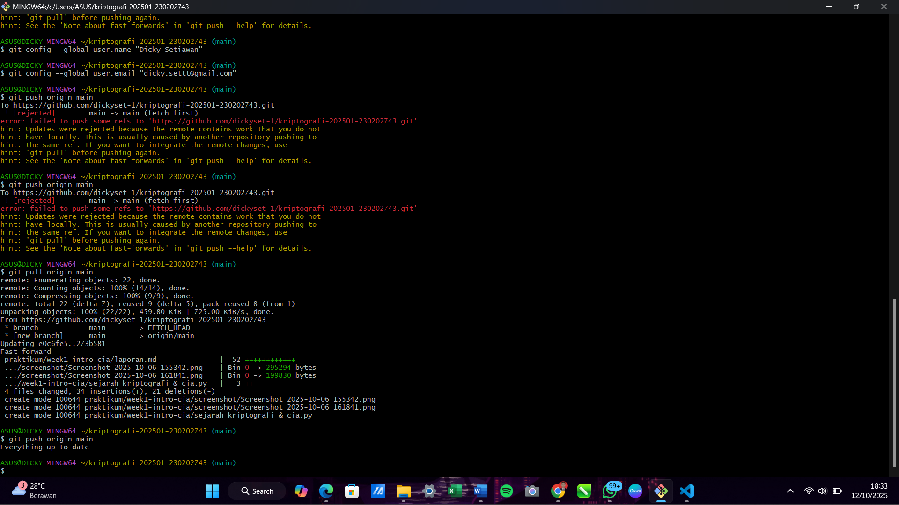
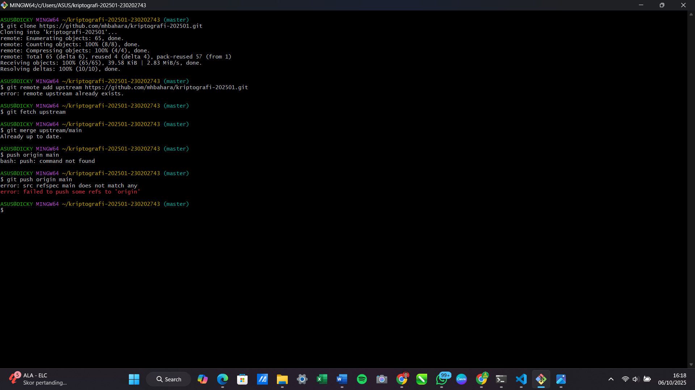

# Laporan Praktikum Kriptografi
Minggu ke-: 1  
Topik: Sejarah Kriptografi & Prinsip CIA  
Nama: Dicky Setiawan  
NIM: 230202743  
Kelas: 5IKRB  

---

## 1. Tujuan
1. Menjelaskan sejarah dan evolusi kriptografi dari masa klasik hingga modern.
2. Menyebutkan prinsip Confidentiality, Integrity, Availability (CIA) dengan benar.
3. Menyimpulkan peran kriptografi dalam sistem keamanan informasi modern.
4. Menyiapkan repositori GitHub sebagai media kerja praktikum.

---

## 2. Dasar Teori
Kriptografi, seni menulis dan memecahkan kode rahasia, telah berevolusi dari metode sederhana menjadi sistem matematis yang kompleks.
​1. Era Kriptografi Klasik
    ​Era ini didominasi oleh teknik berbasis substitusi (mengganti satu huruf dengan huruf lain) dan transposisi (mengubah urutan huruf). Metode-metode ini mengandalkan kerahasiaan algoritma atau kunci yang sangat sederhana.
    ​Caesar Cipher: Ditemukan oleh Julius Caesar, ini adalah bentuk substitusi monoalfabetik tertua dan paling sederhana, di mana setiap huruf dalam plaintext (teks asli) digeser beberapa posisi tetap (misalnya 3) dalam alfabet.
    ​Vigenère Cipher: Merupakan peningkatan dari Caesar Cipher, menggunakan key (kunci) berupa kata dan menerapkan pergeseran yang berbeda untuk setiap huruf, membuatnya menjadi polyalphabetic (multi-alfabet).
​2. Perkembangan Kriptografi Modern
    ​Era ini dimulai dengan munculnya komputer dan kebutuhan akan keamanan data digital. Kriptografi modern menggunakan algoritma matematis yang kompleks dan terbagi menjadi dua kategori utama:
    ​Algoritma Kunci Simetris (Symmetric Key): Menggunakan kunci yang sama untuk enkripsi dan dekripsi. Contoh: AES (Advanced Encryption Standard), yang saat ini menjadi standar enkripsi global yang cepat dan sangat aman.
    ​Algoritma Kunci Asimetris (Asymmetric Key/Public Key): Menggunakan sepasang kunci—kunci publik untuk enkripsi dan kunci privat untuk dekripsi. Contoh: RSA (Rivest–Shamir–Adleman), yang digunakan untuk tanda tangan digital dan pertukaran kunci yang aman.
​3. Evolusi menuju Kriptografi Kontemporer
    ​Kriptografi terus berkembang untuk mengatasi tantangan dunia digital terdistribusi:
    ​Blockchain dan Cryptocurrency: Teknologi seperti Bitcoin dan Ethereum mengandalkan gabungan kriptografi public-key (untuk mengidentifikasi pemilik dompet) dan fungsi hashing (untuk menjaga integritas dan ketertiban transaksi dalam rantai blok) guna menciptakan sistem buku besar terdistribusi yang aman dan tahan terhadap perubahan (immutable).

---

## 3. Alat dan Bahan
(- Python 3.x  
- Visual Studio Code / editor lain  
- Git dan akun GitHub  
- Library tambahan (misalnya pycryptodome, jika diperlukan)  )

---

## 4. Langkah Percobaan
(Tuliskan langkah yang dilakukan sesuai instruksi.  
Contoh format:
1. Membuat file `caesar_cipher.py` di folder `praktikum/week2-cryptosystem/src/`.
2. Menyalin kode program dari panduan praktikum.
3. Menjalankan program dengan perintah `python caesar_cipher.py`.)

---

## 5. Source Code
(Salin kode program utama yang dibuat atau dimodifikasi.  
Gunakan blok kode:

```python
# contoh potongan kode
def encrypt(text, key):
    return ...
```
)

---

## 6. Hasil dan Pembahasan
(- Lampirkan screenshot hasil eksekusi program (taruh di folder `screenshot/`).  
- Berikan tabel atau ringkasan hasil uji jika diperlukan.  
- Jelaskan apakah hasil sesuai ekspektasi.  
- Bahas error (jika ada) dan solusinya. 

Hasil eksekusi program Caesar Cipher:




)

---

## 7. Jawaban Pertanyaan
Prinsip dasar keamanan informasi berpusat pada tiga pilar utama, yang dikenal sebagai CIA Triad: Kerahasiaan (Confidentiality), Integritas (Integrity), dan Ketersediaan (Availability). 
1. Kerahasiaan (Confidentiality), adalah upaya untuk memastikan bahwa data sensitif hanya dapat diakses oleh pihak yang berwenang, misalnya dengan menggunakan enkripsi untuk mengamankan data pengguna agar tidak terbaca oleh penyadap. 

2. Integritas (Integrity), menjamin bahwa data tetap akurat, utuh, dan tidak dimodifikasi secara tidak sah sepanjang siklus hidupnya; hal ini dicapai melalui penggunaan fungsi hashing atau tanda tangan digital, di mana setiap perubahan kecil pada data akan segera terdeteksi.

3. Ketersediaan (Availability), memastikan bahwa sistem, layanan, dan data dapat diakses oleh pengguna yang sah kapan pun dibutuhkan, sebuah prinsip yang sering dipertahankan melalui mekanisme redundansi server dan backup rutin untuk memitigasi risiko kegagalan sistem.
---

## 8. Kesimpulan
Praktikum ini berhasil mengidentifikasi dan merangkum evolusi sejarah kriptografi dari era klasik (seperti Caesar Cipher) hingga modern (seperti AES dan RSA), menyoroti pergeseran dari kerahasiaan algoritma ke kerahasiaan kunci. Selain itu, ketiga pilar fundamental keamanan informasi—Confidentiality, Integrity, dan Availability (CIA)—telah dijelaskan dan dipahami perannya dalam sistem keamanan. Kesimpulannya, kriptografi berfungsi sebagai alat utama yang secara langsung mendukung prinsip CIA, menjadikannya komponen krusial dalam mengamankan informasi di era digital kontemporer.

---

## 9. Daftar Pustaka


---

## 10. Commit Log
(Tuliskan bukti commit Git yang relevan.  
Contoh:
```
commit abc12345
Author: Dicky Setiawan <dicky.settt@gmail.com>
Date:   2025-10-06

    week2-cryptosystem: implementasi Caesar Cipher dan laporan )
```
