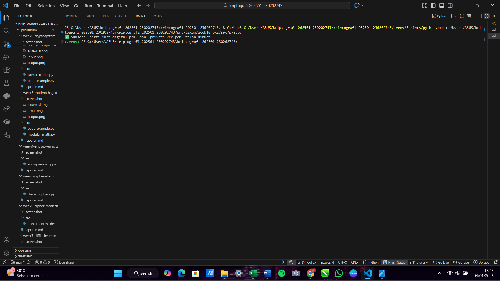
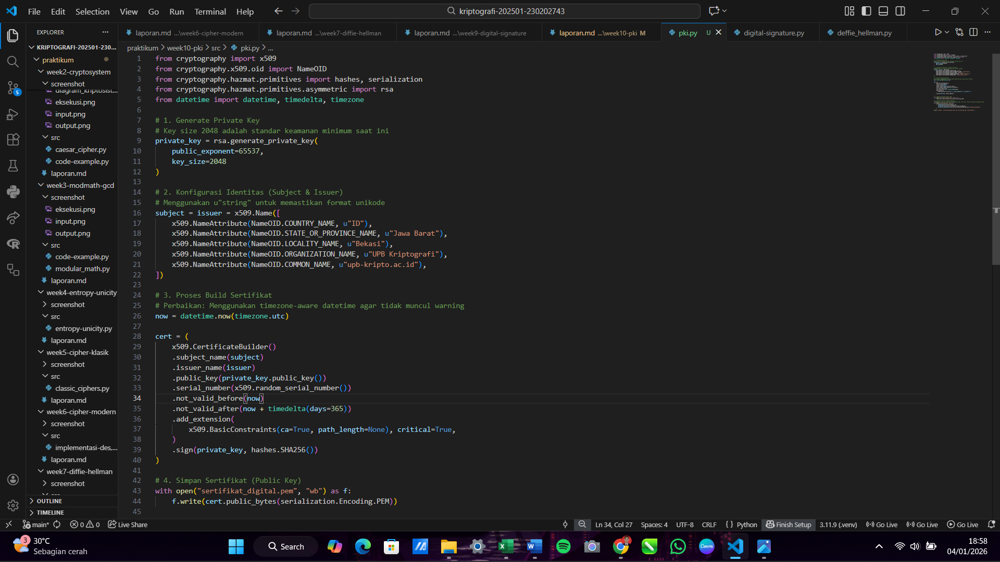

# Laporan Praktikum Kriptografi
Minggu ke-: X  
Topik: Public Key Infrastructure (PKI & Certificate Authority)  
Nama: Dicky Setiawan  
NIM: 230202743  
Kelas: 5 IKRB  

---

## 1. Tujuan
1. Membuat sertifikat digital sederhana.
2. Menjelaskan peran Certificate Authority (CA) dalam sistem PKI.
3. Mengevaluasi fungsi PKI dalam komunikasi aman (contoh: HTTPS, TLS).

---

## 2. Dasar Teori
Public Key Infrastructure (PKI) adalah kerangka kerja keamanan yang memformalisasi dan mengatur penggunaan kriptografi kunci publik di seluruh jaringan. Tujuan utamanya adalah membangun dan mengelola kepercayaan dengan memastikan bahwa kunci publik benar-benar milik entitas yang diklaim. PKI terdiri dari berbagai komponen, termasuk perangkat lunak, kebijakan, dan prosedur, yang bertanggung jawab untuk pembuatan, distribusi, penyimpanan, dan pencabutan Sertifikat Digital. Tanpa PKI, penggunaan kunci publik akan penuh risiko karena tidak ada cara tepercaya untuk memverifikasi siapa pemilik kunci publik yang Anda gunakan untuk enkripsi atau verifikasi tanda tangan.

Peran sentral dalam PKI dipegang oleh Certificate Authority (CA). CA bertindak sebagai pihak ketiga yang tepercaya (trust anchor) yang tugasnya adalah memverifikasi identitas pemohon (seperti website atau perusahaan) dan kemudian secara digital menandatangani Sertifikat Digital mereka. Tanda tangan CA inilah yang meyakinkan web browser dan sistem operasi di seluruh dunia bahwa kunci publik yang terlampir dalam sertifikat tersebut sah dan terikat pada identitas yang benar. Selain penerbitan, CA juga mengelola pencabutan sertifikat melalui mekanisme seperti CRL atau OCSP jika kunci privat diketahui telah bocor.

Singkatnya, Sertifikat Digital adalah inti dari PKI, berfungsi sebagai kartu identitas elektronik yang ditandatangani oleh CA. Hierarki CA, yang biasanya dimulai dari Root CA yang sangat aman, memastikan bahwa kepercayaan dapat diwariskan ke banyak Intermediate CA yang selanjutnya menerbitkan sertifikat kepada pengguna akhir. Sistem ini menyediakan fondasi untuk empat pilar keamanan: kerahasiaan (melalui enkripsi), otentikasi, integritas, dan non-repudiation, yang merupakan syarat mutlak untuk komunikasi dan transaksi yang aman di internet.

---

## 3. Alat dan Bahan
(- Python 3.x  
- Visual Studio Code / editor lain  
- Git dan akun GitHub  
- Library tambahan (misalnya pycryptodome, jika diperlukan)  )

---

## 4. Langkah Percobaan
(Tuliskan langkah yang dilakukan sesuai instruksi.  
Contoh format:
1. Membuat file `pki.py` di folder `praktikum/week10-oki/src/`.
2. Menyalin kode program dari panduan praktikum.
3. Menjalankan program dengan perintah `python pki.py`.)

---

## 5. Source Code
from cryptography import x509
from cryptography.x509.oid import NameOID
from cryptography.hazmat.primitives import hashes, serialization
from cryptography.hazmat.primitives.asymmetric import rsa
from datetime import datetime, timedelta, timezone

# 1. Generate Private Key
# Key size 2048 adalah standar keamanan minimum saat ini
private_key = rsa.generate_private_key(
    public_exponent=65537,
    key_size=2048
)

# 2. Konfigurasi Identitas (Subject & Issuer)
# Menggunakan u"string" untuk memastikan format unikode
subject = issuer = x509.Name([
    x509.NameAttribute(NameOID.COUNTRY_NAME, u"ID"),
    x509.NameAttribute(NameOID.STATE_OR_PROVINCE_NAME, u"Jawa Barat"),
    x509.NameAttribute(NameOID.LOCALITY_NAME, u"Bekasi"),
    x509.NameAttribute(NameOID.ORGANIZATION_NAME, u"UPB Kriptografi"),
    x509.NameAttribute(NameOID.COMMON_NAME, u"upb-kripto.ac.id"),
])

# 3. Proses Build Sertifikat
# Perbaikan: Menggunakan timezone-aware datetime agar tidak muncul warning
now = datetime.now(timezone.utc)

cert = (
    x509.CertificateBuilder()
    .subject_name(subject)
    .issuer_name(issuer)
    .public_key(private_key.public_key())
    .serial_number(x509.random_serial_number())
    .not_valid_before(now)
    .not_valid_after(now + timedelta(days=365))
    .add_extension(
        x509.BasicConstraints(ca=True, path_length=None), critical=True,
    )
    .sign(private_key, hashes.SHA256())
)

# 4. Simpan Sertifikat (Public Key)
with open("sertifikat_digital.pem", "wb") as f:
    f.write(cert.public_bytes(serialization.Encoding.PEM))

# 5. Simpan Private Key (Sangat Penting!)
# Menggunakan enkripsi BestAvailableEncryption agar file kunci tidak bisa dibuka sembarang orang
with open("private_key.pem", "wb") as f:
    f.write(private_key.private_bytes(
        encoding=serialization.Encoding.PEM,
        format=serialization.PrivateFormat.TraditionalOpenSSL,
        encryption_algorithm=serialization.BestAvailableEncryption(b"password-praktikum"),
    ))

print("✅ Sukses: 'sertifikat_digital.pem' dan 'private_key.pem' telah dibuat.")

---

## 6. Hasil dan Pembahasan
(- Lampirkan screenshot hasil eksekusi program (taruh di folder `screenshot/`).  
- Berikan tabel atau ringkasan hasil uji jika diperlukan.  
- Jelaskan apakah hasil sesuai ekspektasi.  
- Bahas error (jika ada) dan solusinya. 

Hasil eksekusi program Caesar Cipher:




)

---

## 7. Jawaban Pertanyaan
1. Fungsi utama dari Certificate Authority (CA) adalah bertindak sebagai pihak ketiga tepercaya (trust anchor) dalam sebuah sistem Public Key Infrastructure (PKI). Tugas inti CA 
   adalah memverifikasi identitas pemohon sertifikat (misalnya, nama domain suatu website) melalui prosedur ketat. Setelah identitas terbukti sah, CA akan menerbitkan Sertifikat Digital yang secara resmi mengikat kunci publik pemohon dengan identitas tersebut, dan menandatanganinya menggunakan kunci privat CA sendiri. Tanda tangan ini menjadi bukti otentikasi universal yang memungkinkan browser atau sistem lain untuk memverifikasi keaslian kunci publik tersebut. Singkatnya, CA adalah penjamin yang memungkinkan kepercayaan dalam ekosistem digital.

2. Meskipun sertifikat self-signed mudah dibuat dan efektif untuk enkripsi internal, sertifikat ini tidak cukup untuk sistem produksi yang berhadapan dengan publik atau pihak 
   eksternal. Sertifikat self-signed tidak memiliki rantai kepercayaan (trust chain) yang terhubung ke Root CA yang sudah tertanam (di-install) di browser dan sistem operasi secara default. Ketika browser atau klien mengakses server dengan sertifikat self-signed, ia tidak dapat memverifikasi identitas penanda tangan dan akan selalu memunculkan peringatan keamanan yang memaksa pengguna untuk secara manual mengabaikan peringatan tersebut. Hal ini merusak kepercayaan pengguna dan tidak dapat diterima untuk layanan publik seperti situs e-commerce atau perbankan.

3. PKI memainkan peran kritis dalam mencegah serangan Man-in-the-Middle (MITM), terutama dalam komunikasi TLS/HTTPS. Ketika klien (seperti browser) mencoba terhubung ke server 
   (misalnya, situs bank), server mengirimkan Sertifikat Digital-nya. Klien kemudian menggunakan kunci publik Root CA yang sudah dipercayai di sistemnya untuk memverifikasi tanda tangan CA pada sertifikat server. Jika penyerang MITM mencoba menyajikan sertifikat palsu yang ditandatangani oleh kunci privat mereka sendiri, verifikasi akan gagal karena kunci publik Root CA yang ada pada klien tidak cocok untuk memverifikasi tanda tangan palsu tersebut. Kegagalan ini menghentikan koneksi sebelum data sensitif dapat ditransfer, sehingga menjamin otentikasi server dan mencegah penyadapan.
---

## 8. Kesimpulan
Praktikum ini berhasil mensimulasikan proses inti Public Key Infrastructure (PKI) dengan membuat sertifikat digital self-signed sederhana menggunakan library Python cryptography, sekaligus memenuhi tujuan membuat sertifikat. Melalui simulasi dan analisis, mahasiswa dapat memahami bahwa Certificate Authority (CA) adalah entitas tepercaya yang kuncinya mengikat identitas (seperti example.com) dengan kunci publik, menjadikannya fondasi dalam membangun rantai kepercayaan digital. Akhirnya, praktikum ini memperkuat pemahaman tentang bagaimana PKI secara keseluruhan berfungsi sebagai kerangka kerja penting untuk menjamin otentikasi dan integritas dalam komunikasi aman seperti HTTPS/TLS, dengan mencegah serangan Man-in-the-Middle melalui verifikasi tanda tangan CA.

---

## 9. Daftar Pustaka


---

## 10. Commit Log

Author: Dicky Setiawan <dicky.settt@ggmail.com>
Date:   2026-01-04

    week10-pki: Public Key Infrastructure (PKI & Certificate Authority)
```
