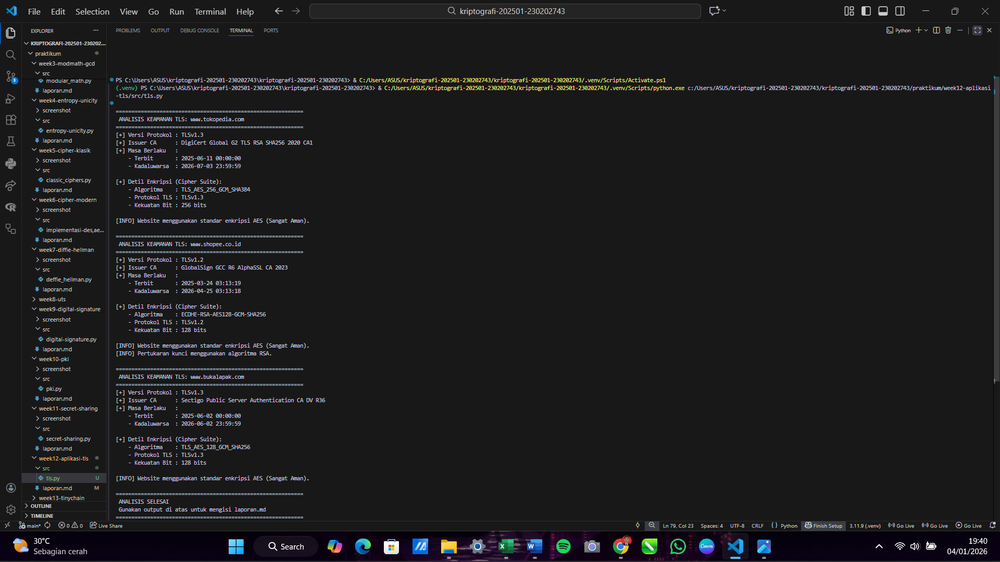
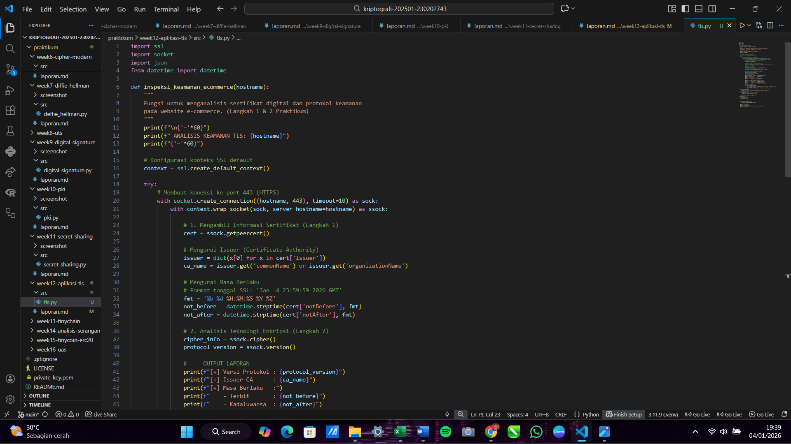

# Laporan Praktikum Kriptografi
Minggu ke-: 12  
Topik: Aplikasi TLS & E-commerce  
Nama: Dicky Setiawan  
NIM: 230202743  
Kelas: 5 IKRB  

---

## 1. Tujuan
1. Menganalisis penggunaan kriptografi pada email dan SSL/TLS.
2. Menjelaskan enkripsi dalam transaksi e-commerce.
3. Mengevaluasi isu etika & privasi dalam penggunaan kriptografi di kehidupan sehari-hari.

---

## 2. Dasar Teori
Transport Layer Security (TLS) merupakan protokol kriptografi standar industri yang dirancang untuk mengamankan komunikasi data melalui jaringan komputer dengan menyediakan enkripsi, autentikasi, dan integritas data. Dalam arsitektur jaringan, TLS beroperasi di atas lapisan transport untuk melindungi protokol aplikasi seperti HTTP (menjadi HTTPS), sehingga memastikan bahwa informasi yang dikirimkan antara klien dan server tidak dapat disadap atau dimanipulasi oleh pihak ketiga. Protokol ini menggunakan kombinasi kriptografi asimetris untuk pertukaran kunci dan kriptografi simetris untuk enkripsi data massal, yang memberikan keseimbangan antara keamanan tinggi dan efisiensi performa.

Dalam ekosistem e-commerce, penerapan TLS menjadi fondasi utama kepercayaan konsumen karena berfungsi melindungi data sensitif seperti nomor kartu kredit, identitas pribadi, dan informasi transaksi. Saat pengguna mengakses situs belanja daring, sertifikat TLS melakukan validasi terhadap identitas server untuk memastikan pelanggan tidak terjebak pada situs palsu (phishing). Proses jabat tangan (handshake) TLS secara otomatis menciptakan saluran aman yang terenkripsi, sehingga meskipun data ditransmisikan melalui jaringan publik atau Wi-Fi terbuka, informasi pembayaran tetap terjaga kerahasiaannya.

Selain aspek teknis keamanan, TLS memiliki peran krusial dalam memenuhi standar regulasi internasional seperti PCI DSS (Payment Card Industry Data Security Standard) yang diwajibkan bagi setiap bisnis e-commerce yang mengelola transaksi kartu. Penggunaan TLS yang diperbarui (seperti versi 1.2 atau 1.3) tidak hanya meningkatkan posisi SEO di mesin pencari, tetapi juga memberikan indikator visual keamanan berupa ikon gembok pada peramban yang meningkatkan konversi penjualan. Tanpa protokol ini, transaksi elektronik akan sangat rentan terhadap serangan Man-in-the-Middle (MitM), yang dapat menghancurkan reputasi bisnis dan menyebabkan kerugian finansial yang masif bagi kedua belah pihak.
---

## 3. Alat dan Bahan
(- Python 3.x  
- Visual Studio Code / editor lain  
- Git dan akun GitHub  
- Library tambahan (misalnya pycryptodome, jika diperlukan)  )

---

## 4. Langkah Percobaan
(Tuliskan langkah yang dilakukan sesuai instruksi.  
Contoh format:
1. Membuat file `tls.py` di folder `praktikum/week12-aplikasi-tls/src/`.
2. Menyalin kode program dari panduan praktikum.
3. Menjalankan program dengan perintah `python tls.py`.)

---

## 5. Source Code
(Salin kode program utama yang dibuat atau dimodifikasi.  
Gunakan blok kode:

```python
import ssl
import socket
import json
from datetime import datetime

def inspeksi_keamanan_ecommerce(hostname):
    """
    Fungsi untuk menganalisis sertifikat digital dan protokol keamanan 
    pada website e-commerce. (Langkah 1 & 2 Praktikum)
    """
    print(f"\n{'='*60}")
    print(f" ANALISIS KEAMANAN TLS: {hostname}")
    print(f"{'='*60}")

    # Konfigurasi konteks SSL default
    context = ssl.create_default_context()
    
    try:
        # Membuat koneksi ke port 443 (HTTPS)
        with socket.create_connection((hostname, 443), timeout=10) as sock:
            with context.wrap_socket(sock, server_hostname=hostname) as ssock:
                
                # 1. Mengambil Informasi Sertifikat (Langkah 1)
                cert = ssock.getpeercert()
                
                # Mengurai Issuer (Certificate Authority)
                issuer = dict(x[0] for x in cert['issuer'])
                ca_name = issuer.get('commonName') or issuer.get('organizationName')
                
                # Mengurai Masa Berlaku
                # Format tanggal SSL: 'Jan  4 23:59:59 2026 GMT'
                fmt = '%b %d %H:%M:%S %Y %Z'
                not_before = datetime.strptime(cert['notBefore'], fmt)
                not_after = datetime.strptime(cert['notAfter'], fmt)
                
                # 2. Analisis Teknologi Enkripsi (Langkah 2)
                cipher_info = ssock.cipher()
                protocol_version = ssock.version()

                # --- OUTPUT LAPORAN ---
                print(f"[+] Versi Protokol : {protocol_version}")
                print(f"[+] Issuer CA      : {ca_name}")
                print(f"[+] Masa Berlaku   :")
                print(f"    - Terbit       : {not_before}")
                print(f"    - Kadaluwarsa  : {not_after}")
                
                print(f"\n[+] Detil Enkripsi (Cipher Suite):")
                print(f"    - Algoritma    : {cipher_info[0]}")
                print(f"    - Protokol TLS : {cipher_info[1]}")
                print(f"    - Kekuatan Bit : {cipher_info[2]} bits")
                
                # Analisis Sederhana
                if "AES" in cipher_info[0]:
                    print("\n[INFO] Website menggunakan standar enkripsi AES (Sangat Aman).")
                if "RSA" in cipher_info[0]:
                    print("[INFO] Pertukaran kunci menggunakan algoritma RSA.")

    except socket.timeout:
        print(f"[!] Error: Koneksi ke {hostname} waktu habis (Timeout).")
    except ssl.SSLError as e:
        print(f"[!] Error SSL pada {hostname}: {e}")
    except Exception as e:
        print(f"[!] Terjadi kesalahan: {e}")

# --- DAFTAR TARGET ANALISIS (Langkah 1) ---
target_ecommerce = [
    "www.tokopedia.com",
    "www.shopee.co.id",
    "www.bukalapak.com"
]

if __name__ == "__main__":
    for site in target_ecommerce:
        inspeksi_keamanan_ecommerce(site)
    
    print(f"\n{'='*60}")
    print(" ANALISIS SELESAI")
    print(" Gunakan output di atas untuk mengisi laporan.md")
    print(f"{'='*60}")
```
)


## 6. Hasil dan Pembahasan
(- Lampirkan screenshot hasil eksekusi program (taruh di folder `screenshot/`).  
- Berikan tabel atau ringkasan hasil uji jika diperlukan.  
- Jelaskan apakah hasil sesuai ekspektasi.  
- Bahas error (jika ada) dan solusinya. 

Hasil eksekusi program Caesar Cipher:




)

---

## 7. Jawaban Pertanyaan
1. Perbedaan utama antara HTTP (Hypertext Transfer Protocol) dan HTTPS (Hypertext Transfer Protocol Secure) terletak pada lapisan keamanan yang membungkus data selama proses 
    transmisi. HTTP mengirimkan data dalam bentuk teks biasa (plain-text), sehingga sangat rentan terhadap penyadapan oleh pihak ketiga yang berada di jaringan yang sama. Sebaliknya, HTTPS menggunakan protokol TLS (Transport Layer Security) untuk mengenkripsi data sebelum dikirimkan, memastikan bahwa informasi hanya dapat dibaca oleh penerima yang sah. Selain enkripsi, HTTPS memberikan jaminan integritas data agar tidak dimodifikasi di tengah jalan serta autentikasi server untuk mencegah serangan situs palsu.

2. Sertifikat digital memegang peran krusial dalam komunikasi TLS karena berfungsi sebagai "kartu identitas" elektronik yang divalidasi oleh otoritas terpercaya atau Certificate 
    Authority (CA). Tanpa sertifikat digital, seorang pengguna tidak dapat memastikan apakah server yang mereka hubungi adalah benar-benar milik penyedia layanan yang sah (misalnya bank atau e-commerce) atau justru server penipu (impersonation). Sertifikat ini mengandung kunci publik (public key) server yang digunakan untuk memulai proses jabat tangan (handshake) TLS secara aman, sehingga memungkinkan pembentukan saluran komunikasi yang terenkripsi dan terpercaya antara klien dan server.

3. Kriptografi mendukung privasi dengan mengubah informasi sensitif menjadi format yang tidak terbaca tanpa kunci yang tepat, memberikan kendali penuh kepada individu atas data 
    pribadi mereka di ruang digital. Namun, kemampuannya dalam menyembunyikan informasi secara absolut menimbulkan tantangan hukum dan etika, terutama bagi aparat penegak hukum yang membutuhkan akses data untuk penyelidikan kriminal atau keamanan nasional. Hal ini menciptakan dilema antara perlindungan hak asasi manusia atas privasi melawan kebutuhan pengawasan publik, di mana penggunaan enkripsi yang terlalu kuat dapat disalahgunakan untuk menyembunyikan aktivitas ilegal, sementara pemberian "pintu belakang" (backdoor) bagi pemerintah dapat melemahkan keamanan sistem secara keseluruhan bagi seluruh pengguna.
---

## 8. Kesimpulan
Praktikum ini berhasil membuktikan peran krusial protokol SSL/TLS dalam mengamankan transaksi e-commerce melalui inspeksi sertifikat digital dan penggunaan algoritma enkripsi seperti AES dan RSA yang menjamin kerahasiaan data pengguna. Melalui analisis perbandingan antara protokol HTTP dan HTTPS, mahasiswa memahami bahwa enkripsi dan autentikasi oleh Certificate Authority (CA) adalah fondasi utama untuk mencegah serangan Man-in-the-Middle di ruang digital. Selain itu, kegiatan ini berhasil mengevaluasi dilema etika dan privasi terkait penggunaan enkripsi, menyimpulkan bahwa perlindungan data pribadi harus seimbang dengan kebijakan audit keamanan dan regulasi pemerintah yang berlaku.
---

## 9. Daftar Pustaka

---

## 10. Commit Log

commit week12-aplikasi-tls
Author: Dicky Setiawan <dicky.settt@gmail.com>
Date:   2026-01-04

    week12-aplikasi-tls : Aplikasi TLS & E-commerce
```
