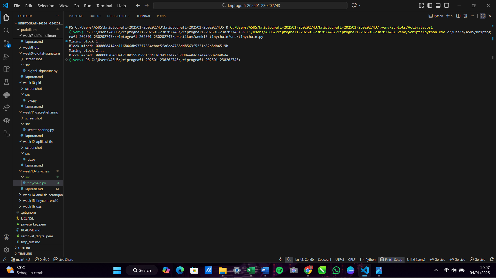
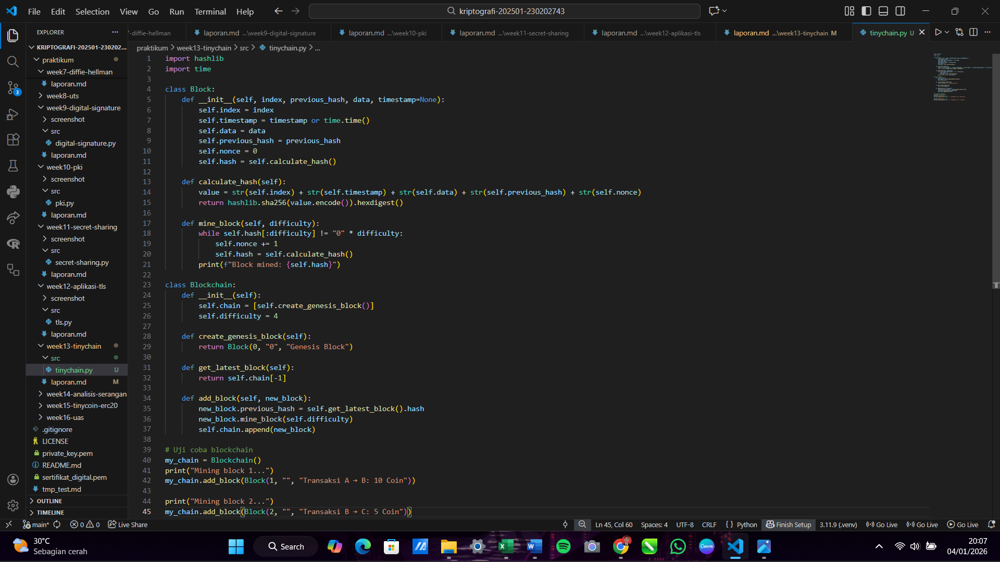

# Laporan Praktikum Kriptografi
Minggu ke-: 13  
Topik: TinyChain – Proof of Work (PoW)  
Nama: DickySetiawan  
NIM: 230202743  
Kelas: 5 IKRB  

---

## 1. Tujuan
1. Menjelaskan peran hash function dalam blockchain.
2. Melakukan simulasi sederhana Proof of Work (PoW).
3. Menganalisis keamanan cryptocurrency berbasis kriptografi.

---

## 2. Dasar Teori
TinyChain merupakan sebuah model implementasi blockchain sederhana yang dirancang untuk mendemonstrasikan prinsip kerja dasar buku besar terdistribusi tanpa kompleksitas berlebihan dari jaringan skala besar. Sistem ini berfungsi sebagai sarana edukasi untuk memahami bagaimana blok-blok data saling terhubung melalui fungsi hash kriptografis dan bagaimana konsensus dicapai di antara para partisipan. Dalam struktur TinyChain, setiap blok menyimpan informasi transaksi, timestamp, hash dari blok sebelumnya, dan sebuah nilai acak yang disebut nonce, yang menjadi elemen kunci dalam proses validasi keamanan data.

Proof of Work (PoW) adalah mekanisme konsensus yang digunakan oleh TinyChain untuk mengamankan jaringan dari manipulasi dan serangan double-spending. Dalam mekanisme ini, para penambang (miners) harus menyelesaikan teka-teki matematika yang sangat sulit, yaitu mencari nilai nonce sedemikian rupa sehingga hash dari blok tersebut memenuhi kriteria kesulitan (difficulty) tertentu, seperti memiliki jumlah nol di depan yang spesifik. Proses penambangan ini membutuhkan daya komputasi yang besar, namun hasilnya sangat mudah diverifikasi oleh partisipan lain di jaringan, sehingga menciptakan hambatan ekonomi bagi siapa pun yang berniat jahat untuk mengubah sejarah transaksi.

Implementasi PoW pada TinyChain menjamin integritas dan imutabilitas data melalui sifat rantai hash yang saling mengunci. Jika seorang peretas mencoba mengubah data pada satu blok, maka nilai hash blok tersebut akan berubah total, yang secara otomatis membatalkan validitas blok-blok berikutnya karena referensi hash sebelumnya tidak lagi cocok. Untuk melakukan perubahan yang sah, penyerang harus melakukan penambangan ulang untuk blok tersebut dan semua blok setelahnya lebih cepat daripada kecepatan seluruh jaringan lainnya (serangan 51%), yang secara praktis sangat sulit dilakukan pada sistem yang terdesentralisasi dengan baik.

---

## 3. Alat dan Bahan
(- Python 3.x  
- Visual Studio Code / editor lain  
- Git dan akun GitHub  
- Library tambahan (misalnya pycryptodome, jika diperlukan)  )

---

## 4. Langkah Percobaan
(Tuliskan langkah yang dilakukan sesuai instruksi.  
Contoh format:
1. Membuat file `tinychain.py` di folder `praktikum/week13-tinychain/src/`.
2. Menyalin kode program dari panduan praktikum.
3. Menjalankan program dengan perintah `python tinychain.py`.)

---

## 5. Source Code
(Salin kode program utama yang dibuat atau dimodifikasi.  
Gunakan blok kode:

```python
import hashlib
import time

class Block:
    def __init__(self, index, previous_hash, data, timestamp=None):
        self.index = index
        self.timestamp = timestamp or time.time()
        self.data = data
        self.previous_hash = previous_hash
        self.nonce = 0
        self.hash = self.calculate_hash()

    def calculate_hash(self):
        value = str(self.index) + str(self.timestamp) + str(self.data) + str(self.previous_hash) + str(self.nonce)
        return hashlib.sha256(value.encode()).hexdigest()

    def mine_block(self, difficulty):
        while self.hash[:difficulty] != "0" * difficulty:
            self.nonce += 1
            self.hash = self.calculate_hash()
        print(f"Block mined: {self.hash}")
        
class Blockchain:
    def __init__(self):
        self.chain = [self.create_genesis_block()]
        self.difficulty = 4

    def create_genesis_block(self):
        return Block(0, "0", "Genesis Block")

    def get_latest_block(self):
        return self.chain[-1]

    def add_block(self, new_block):
        new_block.previous_hash = self.get_latest_block().hash
        new_block.mine_block(self.difficulty)
        self.chain.append(new_block)

# Uji coba blockchain
my_chain = Blockchain()
print("Mining block 1...")
my_chain.add_block(Block(1, "", "Transaksi A → B: 10 Coin"))

print("Mining block 2...")
my_chain.add_block(Block(2, "", "Transaksi B → C: 5 Coin"))
```
)

---

## 6. Hasil dan Pembahasan
(- Lampirkan screenshot hasil eksekusi program (taruh di folder `screenshot/`).  
- Berikan tabel atau ringkasan hasil uji jika diperlukan.  
- Jelaskan apakah hasil sesuai ekspektasi.  
- Bahas error (jika ada) dan solusinya. 

Hasil eksekusi program Caesar Cipher:




)

---

## 7. Jawaban Pertanyaan
1. Pentingnya Fungsi Hash dalam Blockchain
    Fungsi hash adalah fondasi integritas blockchain karena kemampuannya dalam menciptakan "sidik jari digital" yang unik untuk setiap blok data. Dalam struktur blok, fungsi hash digunakan untuk menghubungkan satu blok dengan blok sebelumnya melalui previous_hash, sehingga membentuk rantai yang tidak terputus. Jika data dalam suatu blok diubah sekecil apa pun, nilai hash blok tersebut akan berubah total secara drastis (efek avalanche), yang secara otomatis memutus rantai dan membuat blok-blok berikutnya menjadi tidak valid. Hal ini menjamin sifat imutabilitas, di mana data yang sudah masuk ke dalam blockchain hampir mustahil untuk dimodifikasi tanpa terdeteksi oleh seluruh jaringan.

2. Bagaimana Proof of Work Mencegah Double Spending
    Double spending adalah risiko di mana aset digital yang sama digunakan untuk lebih dari satu transaksi secara bersamaan. Proof of Work mencegah hal ini dengan cara memaksa setiap transaksi untuk dikonfirmasi melalui proses penambangan (mining) yang memerlukan daya komputasi besar.
    - Urutan Transaksi: PoW memastikan bahwa transaksi dicatat secara kronologis dalam blok-blok yang berurutan.
    - Mekanisme Konsensus: Jaringan hanya menerima satu versi rantai terpanjang (rantai dengan akumulasi kerja komputasi terbanyak).
    - Biaya Penyerangan: Untuk melakukan double spending, penyerang harus menguasai lebih dari 51% daya komputasi jaringan (serangan 51%) guna menulis ulang sejarah transaksi lebih cepat daripada penambang lainnya, yang secara ekonomis sangat mahal dan hampir tidak mungkin dilakukan pada jaringan besar seperti Bitcoin.

3. Kelemahan PoW dalam Hal Efisiensi Energi
    Kelemahan utama dari Proof of Work adalah konsumsi energi yang sangat boros karena desainnya yang sengaja dibuat sulit.
    - Komputasi Sia-sia: Jutaan perangkat keras di seluruh dunia terus-menerus melakukan perhitungan matematis (mencari nonce) yang tidak memiliki kegunaan praktis selain untuk mengamankan jaringan.
    - Perlombaan Perangkat Keras: Semakin tinggi harga aset kripto, semakin banyak penambang yang bergabung, yang memicu kenaikan difficulty dan kebutuhan akan perangkat keras yang lebih haus daya.
    - Jejak Karbon: Banyak fasilitas penambangan skala besar yang masih mengandalkan sumber energi non-terbarukan, sehingga menimbulkan kritik keras terkait dampak lingkungan dan keberlanjutan jangka panjang dibandingkan mekanisme konsensus lain seperti Proof of Stake (PoS).
---

## 8. Kesimpulan
Praktikum ini berhasil mensimulasikan mekanisme Proof of Work pada TinyChain, di mana proses penambangan (mining) terbukti memerlukan usaha komputasi yang signifikan untuk menemukan nilai nonce yang sesuai dengan target difficulty. Keamanan blockchain terjamin melalui keterkaitan hash antar blok, sehingga setiap upaya manipulasi data pada satu blok akan secara otomatis membatalkan validitas seluruh rantai berikutnya. Hasil ini menunjukkan bahwa protokol konsensus PoW efektif dalam menciptakan buku besar digital yang bersifat imutabel dan tahan terhadap serangan perubahan data.

---

## 9. Daftar Pustaka


---

## 10. Commit Log

commit week13-tinychain
Author: Dicky Setiawan <dicky.settt@gmail.com>
Date:   2026-01-04

    week13-tinychain : TinyChain – Proof of Work (PoW)
```
