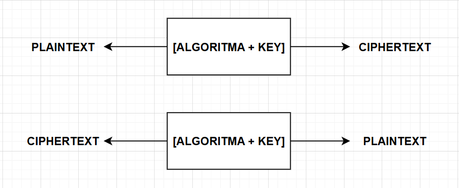

# Laporan Praktikum Kriptografi
Minggu ke-: 2
Topik: Cryptosystem  
Nama: Dicky Setiawan
NIM: 230202743
Kelas: 5 IKRB 

---

## 1. Tujuan
1. Mengidentifikasi komponen dasar kriptosistem (plaintext, ciphertext, kunci, algoritma).
2. Menggambarkan proses enkripsi dan dekripsi sederhana.
3. Mengklasifikasikan jenis kriptosistem (simetris dan asimetris).

---

## 2. Dasar Teori
CIPHER KLASIK
Cipher Klasik dan Konsep DasarKriptografi klasik adalah studi tentang metode enkripsi yang digunakan sebelum munculnya komputer dan algoritma modern. Cipher klasik adalah algoritma enkripsi yang menggunakan teknik substitusi atau transposisi untuk mengaburkan pesan. Dalam substitusi, setiap unit teks terang (biasanya huruf) digantikan oleh unit teks tersandi yang lain. Contohnya adalah Caesar Cipher, di mana setiap huruf diganti dengan huruf ketiga setelahnya dalam alfabet (pergeseran konstan). Sebaliknya, transposisi (atau permutasian) mengubah urutan huruf tanpa mengubah huruf itu sendiri. Teks terang (plaintext) adalah pesan asli yang dapat dibaca, sedangkan teks tersandi (ciphertext) adalah bentuk terenkripsi yang tidak dapat dibaca. Proses mengubah teks terang menjadi teks tersandi disebut enkripsi, dan proses sebaliknya disebut dekripsi. Keamanan cipher klasik sangat bergantung pada kerahasiaan kunci, yang merupakan informasi rahasia yang mengontrol enkripsi dan dekripsi.

ARITMETIKA MODULAR
Aritmetika Modular adalah sistem aritmetika untuk bilangan bulat, di mana bilangan 'membungkus' kembali (wrap around) setelah mencapai nilai tertentu yang disebut modulus ($n$). Konsep utamanya adalah kekongruenan modulo $n$. Dua bilangan bulat, $a$ dan $b$, dikatakan kongruen modulo $n$ (ditulis sebagai $a \equiv b \pmod{n}$) jika selisihnya ($a - b$) habis dibagi oleh $n$. Secara ekuivalen, $a$ dan $b$ memiliki sisa yang sama ketika dibagi oleh $n$. Operasi yang paling sering digunakan adalah mencari sisa, yang dilambangkan sebagai $a \bmod n$. Misalnya, $10 \bmod 3 = 1$ karena $10 = 3 \times 3 + 1$. Konsep ini sangat fundamental dalam kriptografi, khususnya dalam cipher substitusi, karena memungkinkan operasi pergeseran pada alfabet (yang secara inheren merupakan siklus) dengan mengaitkan setiap huruf dengan bilangan bulat (biasanya $A=0, B=1, \dots, Z=25$) dan melakukan operasi matematika $\bmod 26$.

---

## 3. Alat dan Bahan
(- Python 3.x  
- Visual Studio Code / editor lain  
- Git dan akun GitHub  
- Library tambahan (misalnya pycryptodome, jika diperlukan)  )

---

## 4. Langkah Percobaan
(Tuliskan langkah yang dilakukan sesuai instruksi.  
Contoh format:
1. Membuat file `caesar_cipher.py` di folder `praktikum/week2-cryptosystem/src/`.
2. Menyalin kode program dari panduan praktikum.
3. Menjalankan program dengan perintah `python caesar_cipher.py`.)

---

## 5. Source Code
(Salin kode program utama yang dibuat atau dimodifikasi.  
Gunakan blok kode:

```python
# contoh potongan kode
def encrypt(text, key):
    return ...
```
)

---

## 6. Hasil dan Pembahasan
(- Lampirkan screenshot hasil eksekusi program (taruh di folder `screenshot/`).  
- Berikan tabel atau ringkasan hasil uji jika diperlukan.  
- Jelaskan apakah hasil sesuai ekspektasi.  
- Bahas error (jika ada) dan solusinya. 

Hasil eksekusi program Caesar Cipher:



)

---

## 7. Jawaban Pertanyaan
1. Komponen utama dalam sebuah kriptosistem meliputi lima elemen mendasar: Teks Terang        (Plaintext), yaitu pesan asli; Teks Tersandi (Ciphertext), yaitu bentuk pesan yang terenkripsi; Algoritma Kriptografi (seperti AES atau RSA), yang merupakan prosedur matematika untuk melakukan enkripsi dan dekripsi; Kunci (Key), yaitu nilai rahasia yang mengontrol operasi algoritma dan menjadi penentu keamanan sistem; dan terakhir, Protokol/Prosedur, yaitu aturan yang mengatur bagaimana komponen lain berinteraksi, terutama selama proses pertukaran kunci dan sesi komunikasi.

2. Mengenai perbandingan kelebihan dan kelemahan, sistem simetris (menggunakan satu kunci) memiliki keunggulan besar dalam hal kecepatan dan efisiensi komputasi karena algoritmanya yang lebih sederhana, menjadikannya ideal untuk mengenkripsi data dalam jumlah besar. Namun, kelemahannya terletak pada masalah distribusi kunci dan kurangnya otentikasi. Sebaliknya, sistem asimetris (menggunakan pasangan kunci publik dan privat) unggul dalam distribusi kunci yang aman dan menyediakan tanda tangan digital untuk otentikasi dan non-repudiasi, tetapi sistem ini secara signifikan lebih lambat dan membutuhkan kunci yang jauh lebih panjang untuk tingkat keamanan yang setara.

3. Distribusi kunci menjadi masalah utama dalam kriptografi simetris karena kunci rahasia yang sama harus dibagikan oleh kedua belah pihak melalui saluran yang sudah aman atau secara fisik, yang sulit dan tidak skalabel secara online. Mengirim kunci melalui saluran yang tidak aman membuatnya rentan terhadap intersepsi, yang akan mengkompromikan seluruh komunikasi. Karena alasan ini, kriptografi simetris sering dikombinasikan dengan sistem asimetris; di mana kunci publik digunakan untuk mengenkripsi dan menukar kunci rahasia simetris yang kemudian digunakan untuk sesi komunikasi yang lebih cepat.
)
---

## 8. Kesimpulan
(Tuliskan kesimpulan singkat (2–3 kalimat) berdasarkan percobaan.  )

---

## 9. Daftar Pustaka

---

## 10. Commit Log
(Tuliskan bukti commit Git yang relevan.  
Contoh:
```
commit abc12345
Author: Dicky Setiawan <dicky.settt@gmail.com>
Date:   2025-10-20

    week2-cryptosystem: implementasi Caesar Cipher dan laporan )
```
