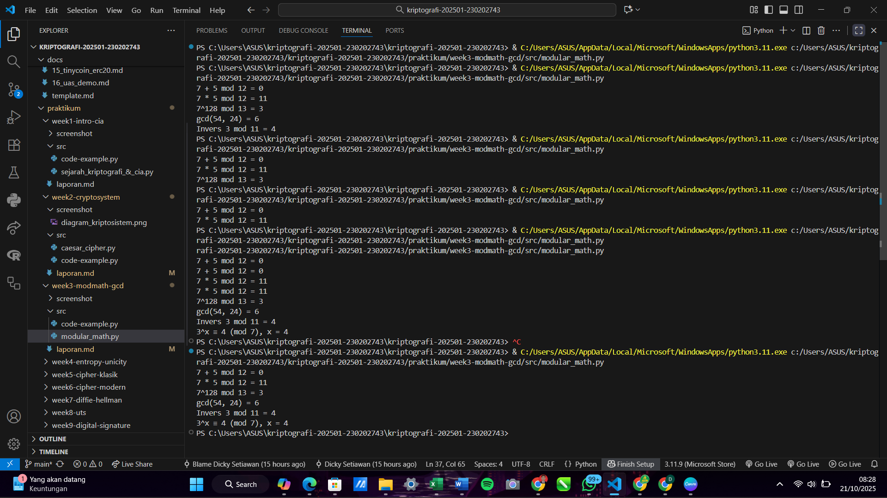
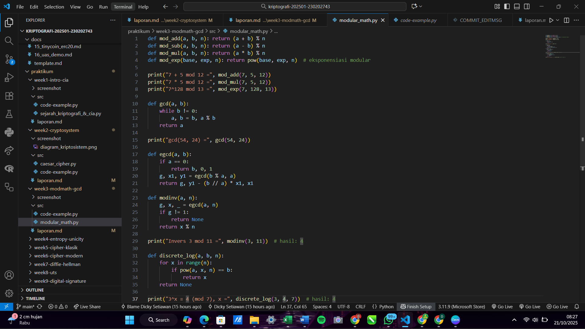

# Laporan Praktikum Kriptografi
Minggu ke-: 3   
Topik: Modular Math (Aritmetika Modular, GCD, Bilangan Prima, Logaritma Diskrit)    
Nama: Dicky Setiawan    
NIM: 230202743  
Kelas: 5 IKRB   

---

## 1. Tujuan
1. Menyelesaikan operasi aritmetika modular.
2. Menentukan bilangan prima dan menghitung GCD (Greatest Common Divisor).
3. Menerapkan logaritma diskrit sederhana dalam simulasi kriptografi.

---

## 2. Dasar Teori
Cipher klasik adalah algoritma enkripsi yang digunakan sebelum era komputer modern, beroperasi dengan dua teknik dasar: substitusi (mengganti satu unit teks terang dengan unit lain, misalnya Caesar Cipher) atau transposisi (mengubah urutan unit teks terang). Tujuannya adalah mengubah teks terang (pesan asli) menjadi teks tersandi (bentuk terenkripsi) menggunakan suatu kunci rahasia. Keamanan cipher ini sepenuhnya bergantung pada kerahasiaan kuncinya, bukan pada kerumitan algoritmanya.

Aritmetika modular adalah sistem matematika yang melibatkan bilangan bulat, di mana bilangan 'melingkar' (wrap around) setelah mencapai nilai tertentu yang disebut modulus ($n$). Inti konsepnya adalah kekongruenan modulo $n$ (ditulis $a \equiv b \pmod{n}$), yang berarti $a$ dan $b$ memiliki sisa yang sama ketika dibagi dengan $n$. Dalam kriptografi klasik, konsep ini sangat fundamental. Misalnya, untuk mengimplementasikan pergeseran pada alfabet 26 huruf (A=0 hingga Z=25), operasi aritmetika selalu dilakukan modulo 26. Ini memastikan hasil operasi, seperti penambahan kunci (pergeseran), selalu berada dalam rentang indeks alfabet (0 sampai 25).

---

## 3. Alat dan Bahan
(- Python 3.x  
- Visual Studio Code / editor lain  
- Git dan akun GitHub  
- Library tambahan (misalnya pycryptodome, jika diperlukan)  )

---

## 4. Langkah Percobaan
(Tuliskan langkah yang dilakukan sesuai instruksi.  
Contoh format:
1. Membuat file `caesar_cipher.py` di folder `praktikum/week2-cryptosystem/src/`.
2. Menyalin kode program dari panduan praktikum.
3. Menjalankan program dengan perintah `python caesar_cipher.py`.)

---

## 5. Source Code
def mod_add(a, b, n): return (a + b) % n
def mod_sub(a, b, n): return (a - b) % n
def mod_mul(a, b, n): return (a * b) % n
def mod_exp(base, exp, n): return pow(base, exp, n)  # eksponensiasi modular

print("7 + 5 mod 12 =", mod_add(7, 5, 12))
print("7 * 5 mod 12 =", mod_mul(7, 5, 12))
print("7^128 mod 13 =", mod_exp(7, 128, 13))

def gcd(a, b):
    while b != 0:
        a, b = b, a % b
    return a

print("gcd(54, 24) =", gcd(54, 24))

def egcd(a, b):
    if a == 0:
        return b, 0, 1
    g, x1, y1 = egcd(b % a, a)
    return g, y1 - (b // a) * x1, x1

def modinv(a, n):
    g, x, _ = egcd(a, n)
    if g != 1:
        return None
    return x % n

print("Invers 3 mod 11 =", modinv(3, 11))  # hasil: 4

def discrete_log(a, b, n):
    for x in range(n):
        if pow(a, x, n) == b:
            return x
    return None

print("3^x ≡ 4 (mod 7), x =", discrete_log(3, 4, 7))  # hasil: 4

---

## 6. Hasil dan Pembahasan
(- Lampirkan screenshot hasil eksekusi program (taruh di folder `screenshots/`).  
- Berikan tabel atau ringkasan hasil uji jika diperlukan.  
- Jelaskan apakah hasil sesuai ekspektasi.  
- Bahas error (jika ada) dan solusinya. 

Hasil eksekusi program Caesar Cipher:




)

---

## 7. Jawaban Pertanyaan
1. Peran Aritmetika Modular dalam Kriptografi ModernAritmetika modular, khususnya operasi modulo $n$, memainkan peran sentral dalam kriptografi modern karena propertinya yang menghasilkan output dalam rentang terbatas, menjadikannya ideal untuk mengelola kunci dan data yang berukuran besar.Enkripsi dan Dekripsi: Operasi modular memastikan bahwa hasil perhitungan, seperti penambahan, perkalian, atau pemangkatan, selalu berada dalam batas tertentu (misalnya, $\bmod 26$ untuk alfabet, atau $\bmod p$ untuk kelompok yang lebih besar). Hal ini penting untuk membatasi ruang state dan memungkinkan pemetaan bolak-balik (invers).Keamanan: Banyak algoritma modern (seperti RSA dan Diffie-Hellman) keamanannya didasarkan pada kesulitan menyelesaikan masalah matematika yang melibatkan operasi modular, seperti faktorisasi bilangan bulat besar atau masalah logaritma diskrit.Pembuatan Tanda Tangan Digital: Aritmetika modular digunakan dalam fungsi hash dan dalam proses penandatanganan dan verifikasi tanda tangan digital untuk memastikan integritas dan keaslian pesan.

2. Pentingnya Invers Modular dalam Algoritma Kunci PublikInvers modular sangat penting dalam banyak algoritma kunci publik, terutama RSA, karena memungkinkan adanya dekripsi dari suatu pesan.Invers modular dari bilangan a modulo n adalah bilangan x sedemikian rupa sehingga:$$a \cdot x \equiv 1 \pmod{n}$$Di RSA:Kunci publik adalah $(e, n)$, di mana $e$ adalah eksponen enkripsi.Kunci privat adalah $(d, n)$, di mana $d$ adalah eksponen dekripsi.Eksponen dekripsi (d) harus menjadi invers modular dari eksponen enkripsi (e) modulo ϕ(n) (fungsi Euler totient dari n). Dengan kata lain:$$e \cdot d \equiv 1 \pmod{\phi(n)}$$Tanpa $d$ sebagai invers modular dari $e$, tidak mungkin membalikkan proses pemangkatan modular yang digunakan selama enkripsi. Extended Euclidean Algorithm adalah metode utama yang digunakan untuk menghitung invers modular ini secara efisien.

3. Tantangan Utama dalam Menyelesaikan Logaritma Diskrit untuk Modulus BesarMasalah Logaritma Diskrit (DLP) adalah masalah matematika di mana diberikan bilangan g, a, dan modulus p, sulit untuk menemukan eksponen x sedemikian rupa sehingga:$$g^x \equiv a \pmod{p}$$Tantangan utama dalam menyelesaikan DLP untuk modulus besar (yang digunakan dalam kriptografi seperti Diffie-Hellman dan ElGamal) adalah:Kompleksitas Komputasi Eksponensial: Tidak ada algoritma sub-eksponensial umum yang diketahui yang dapat menyelesaikan DLP dengan cepat. Mencoba setiap nilai $x$ (pencarian brute-force) membutuhkan waktu yang sebanding dengan modulus ($p$), menjadikannya tidak layak secara komputasi ketika $p$ adalah bilangan prima yang sangat besar (misalnya, lebih dari 2048 bit).Algoritma Serangan Terbaik Masih Lambat: Algoritma yang paling efektif yang diketahui, seperti Number Field Sieve (NFS) (khususnya General Number Field Sieve/GNFS untuk DLP), meskipun lebih cepat daripada brute-force, tetap membutuhkan waktu sub-eksponensial yang besar. Ukuran modulus yang digunakan dalam kriptografi modern sengaja dipilih agar waktu yang dibutuhkan oleh GNFS melebihi batas praktis.Efek Satu Arah (Trapdoor Function): Mudah untuk menghitung $g^x \pmod{p}$ (operasi maju), tetapi sangat sulit untuk membalikkan operasi tersebut (operasi mundur). Asimetri komputasi ini adalah landasan keamanan skema kriptografi berbasis DLP.
---

## 8. Kesimpulan
Praktikum ini berhasil mengimplementasikan dan memverifikasi operasi dasar aritmetika modular (penjumlahan, perkalian, eksponensiasi), Algoritma Euclidean untuk GCD, dan perhitungan invers modular. Dengan kode yang berfungsi, percobaan ini membuktikan bahwa aritmetika modular adalah dasar matematika yang memungkinkan perhitungan Logaritma Diskrit dan sangat penting sebagai fondasi komputasi untuk mekanisme enkripsi dan dekripsi dalam kriptografi modern.

---

## 9. Daftar Pustaka


---

## 10. Commit Log
(Tuliskan bukti commit Git yang relevan.  
Contoh:
```
commit abc12345
Author: Dicky Setiawan <dicky.settt@gmail.com>
Date:   2025-10-21

    week2-cryptosystem: implementasi Caesar Cipher dan laporan )
```
