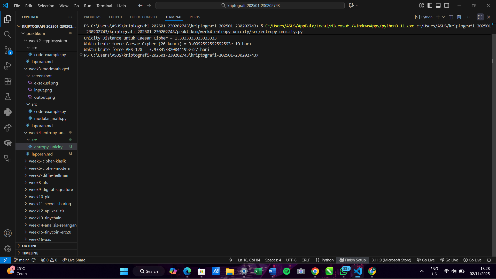

# Laporan Praktikum Kriptografi
Minggu ke-: 4  
Topik: Entropy & Unicity Distance (Evaluasi Kekuatan Kunci dan Brute Force)  
Nama: Dicky Setiawan  
NIM: 230202743  
Kelas: 5 IKRB  

---

## 1. Tujuan
1. Menyelesaikan perhitungan sederhana terkait entropi kunci.
2. Menggunakan teorema Euler pada contoh perhitungan modular & invers.
3. Menghitung unicity distance untuk ciphertext tertentu.
4. Menganalisis kekuatan kunci berdasarkan entropi dan unicity distance.
5. Mengevaluasi potensi serangan brute force pada kriptosistem sederhana.


---

## 2. Dasar Teori
Entropi Kunci ($H(K)$)Entropi kunci adalah ukuran ketidakpastian atau keacakan dari sebuah kunci kriptografi. Nilai ini diukur dalam satuan bit dan secara langsung menunjukkan seberapa besar ruang kunci (keyspace) yang harus dicari oleh penyerang saat melakukan serangan brute force. Secara matematis, Entropi dihitung menggunakan rumus $H(K) = \log_2 |K|$, di mana $|K|$ adalah total jumlah kunci unik yang mungkin. Semakin tinggi nilai Entropi, semakin besar keragaman kunci, dan secara eksponensial, semakin aman sistem kriptografi tersebut karena waktu yang dibutuhkan untuk menemukan kunci yang benar akan jauh lebih lama. Misalnya, kunci 128-bit memiliki Entropi 128, yang jauh lebih aman daripada kunci 4-bit yang hanya memiliki 16 kemungkinan kunci.

Unicity Distance ($U$)Unicity Distance adalah jumlah minimum teks tersandi (ciphertext) yang dibutuhkan oleh seorang kriptanalis untuk secara teoretis menentukan kunci enkripsi yang benar dengan sangat yakin melalui analisis frekuensi. Konsep ini sangat relevan untuk cipher klasik atau cipher substitusi yang rentan terhadap analisis frekuensi, seperti Caesar Cipher atau Vigenère Cipher. Nilai Unicity Distance dihitung dengan membagi Entropi kunci ($H(K)$) dengan redundansi bahasa dikalikan logaritma ukuran alfabet.

Nilai Unicity Distance secara efektif menunjukkan kapan ciphertext menjadi "cukup panjang" sehingga hanya ada satu kunci yang masuk akal yang dapat menghasilkan plaintext yang koheren (memiliki arti) berdasarkan properti statistik bahasa (misalnya, bahasa Inggris). Jika panjang ciphertext yang tersedia kurang dari Unicity Distance, mungkin ada beberapa kunci palsu yang menghasilkan plaintext yang terlihat benar, membuat serangan menjadi tidak meyakinkan. Namun, begitu panjang ciphertext melebihi Unicity Distance, kunci yang benar biasanya menjadi jelas, yang berarti keamanan sistem, pada titik itu, hanya bergantung pada kerahasiaan kuncinya, bukan pada kerahasiaan algoritmanya (Prinsip Kerckhoffs).

---

## 3. Alat dan Bahan
(- Python 3.x  
- Visual Studio Code / editor lain  
- Git dan akun GitHub  
- Library tambahan (misalnya pycryptodome, jika diperlukan)  )

---

## 4. Langkah Percobaan
(Tuliskan langkah yang dilakukan sesuai instruksi.  
Contoh format:
1. Membuat file `caesar_cipher.py` di folder `praktikum/week2-cryptosystem/src/`.
2. Menyalin kode program dari panduan praktikum.
3. Menjalankan program dengan perintah `python caesar_cipher.py`.)

---

## 5. Source Code
import math

def entropy(keyspace_size):
    return math.log2(keyspace_size)

print("Entropy ruang kunci 26 =", entropy(26), "bit")
print("Entropy ruang kunci 2^128 =", entropy(2**128), "bit")
def unicity_distance(HK, R=0.75, A=26):
    return HK / (R * math.log2(A))

HK = entropy(26)
print("Unicity Distance untuk Caesar Cipher =", unicity_distance(HK))
def brute_force_time(keyspace_size, attempts_per_second=1e6):
    seconds = keyspace_size / attempts_per_second
    days = seconds / (3600*24)
    return days

print("Waktu brute force Caesar Cipher (26 kunci) =", brute_force_time(26), "hari")
print("Waktu brute force AES-128 =", brute_force_time(2**128), "hari")

---

## 6. Hasil dan Pembahasan
(- Lampirkan screenshot hasil eksekusi program (taruh di folder `screenshot/`).  
- Berikan tabel atau ringkasan hasil uji jika diperlukan.  
- Jelaskan apakah hasil sesuai ekspektasi.  
- Bahas error (jika ada) dan solusinya. 

Hasil eksekusi program Caesar Cipher:


Percobaan menjalankan tiga fungsi utama yang didefinisikan dalam entropy-unicity.py:A. Perhitungan Entropi ($H(K)$)Rumus: $H(K) = \log_2 |K|$Tujuan: Menentukan ukuran keamanan informasi kunci dalam bit.Caesar: $H(K) = \log_2(26) \approx 4.7 \text{ bit}$AES-128: $H(K) = \log_2(2^{128}) = 128 \text{ bit}$B. Perhitungan Unicity Distance ($U$)Rumus: $U = \frac{H(K)}{R \cdot \log_2 |A|}$Tujuan: Menentukan panjang minimum ciphertext untuk mengidentifikasi kunci yang benar secara unik.Hanya dihitung untuk Caesar Cipher.C. Estimasi Waktu Brute ForceRumus: $\text{Waktu (hari)} = \frac{|K|}{\text{Percobaan/detik} \cdot (3600 \cdot 24)}$Tujuan: Mengestimasi waktu komputasi yang dibutuhkan untuk mencoba semua kunci.


Input (Data Masukan)Ruang Kunci ($|K|$):Caesar Cipher: $|K| = 26$ (kunci yang sangat kecil, mewakili cipher klasik).AES-128: $|K| = 2^{128}$ (kunci yang sangat besar, mewakili cipher modern).Parameter Bahasa (untuk Unicity Distance):Redundansi Bahasa ($R$): $R = 0.75$ (nilai umum untuk bahasa Inggris).Ukuran Alfabet ($|A|$): $|A| = 26$ (untuk A-Z).Parameter Komputasi (untuk Brute Force):Kecepatan Percobaan: $10^6$ upaya per detik ($\text{attempts per second}=1\text{e}6$).


Output dari terminal menunjukkan hasil perhitungan untuk Unicity Distance dan waktu Brute Force:| Metrik | Caesar Cipher ($|K|=26$) | AES-128 ($|K|=2^{128}$) | Interpretasi Keamanan || :--- | :--- | :--- | :--- || Unicity Distance | $\approx **1.333**$ karakter | Tidak dihitung/relevan | Keamanan sangat rendah. Hanya butuh $\approx 2$ karakter ciphertext untuk memecahkan kunci dengan analisis frekuensi. || Waktu Brute Force | $3.009 \text{e}^{-5}$ hari | $3.938 \text{e}^{+27}$ hari | Instan. Dapat dipecahkan dalam hitungan milidetik. || | | Tidak Praktis. Melebihi usia alam semesta, menunjukkan keamanan komputasi yang tinggi. |

---

## 7. Jawaban Pertanyaan
1.  Arti Nilai Entropi dalam Konteks Kekuatan Kunci
    Nilai entropi (H(K)) dalam konteks kekuatan kunci adalah ukuran langsung dari ketidakpastian (randomness) dan ukuran ruang kunci (keyspace). Nilai ini diukur dalam bit.

    Semakin tinggi nilai entropi (misalnya 128 bit), semakin besar pula ruang kunci yang harus digeledah oleh penyerang. Secara sederhana, Entropi N bit berarti ada 2 N kemungkinan kunci yang harus dicoba, yang secara eksponensial meningkatkan waktu yang diperlukan untuk serangan brute force.

    Oleh karena itu, Entropi berfungsi sebagai metrik utama untuk menentukan kekuatan komputasi suatu kunci; kunci dengan entropi rendah (seperti 4.7 bit pada Caesar Cipher) dianggap lemah, sedangkan kunci dengan entropi tinggi (seperti 128 bit pada AES) dianggap kuat secara komputasi.

2.  Pentingnya Unicity Distance dalam Keamanan Cipher
    Unicity distance (U) adalah panjang minimum ciphertext yang diperlukan untuk menghilangkan ambiguitas kunci yang benar. Jarak ini penting karena:

    Menentukan Titik Kelemahan Analisis: Unicity Distance menunjukkan kapan ciphertext menjadi "cukup panjang" sehingga properti statistik bahasa (redundancy) dapat digunakan untuk memecahkan kode. Sebelum mencapai jarak ini, mungkin ada beberapa kunci palsu yang menghasilkan plaintext yang tampak masuk akal. Begitu jarak terlampaui, biasanya hanya ada satu kunci yang menghasilkan plaintext yang koheren.

    Kelemahan Cipher Klasik: Untuk cipher klasik seperti Caesar atau Vigenère, nilai Unicity Distance yang sangat kecil (seperti ≈1.33 karakter pada contoh Anda) menunjukkan bahwa keamanan cipher tersebut dapat langsung runtuh begitu analis memiliki sedikit ciphertext. Ini membuktikan bahwa cipher tersebut rentan terhadap kriptanalisis.

3.  Ancaman Brute Force Meskipun Algoritma Kuat
    Serangan brute force masih menjadi ancaman teoretis, bahkan ketika algoritma enkripsi (seperti AES) sudah sangat kuat, karena alasan-alasan berikut:

    Pengujian Jaminan Keamanan: Brute force adalah standar emas untuk menguji batas atas keamanan komputasi suatu cipher. Jika waktu brute force untuk AES-128 adalah 3.9e + 27 hari, ini memberikan jaminan bahwa cipher tersebut sangat aman terhadap serangan saat ini.

    Kunci yang Lemah (Entropi Rendah): Seringkali, masalahnya bukan pada algoritma (AES), melainkan pada kunci yang dipilih oleh pengguna. Jika pengguna memilih kata sandi yang lemah dan mudah ditebak, atau jika kunci dihasilkan dengan entropi rendah (misalnya hanya 30 bit), penyerang akan mengabaikan ruang kunci 2^128 dan hanya menyerang ruang kunci yang kecil dan terprediksi tersebut.

    Kemajuan Komputasi dan Kuantum: Meskipun saat ini tidak praktis, ancaman brute force masa depan, terutama dari komputer kuantum, selalu menjadi pertimbangan. Komputer kuantum berpotensi menggunakan algoritma Shor atau Grover untuk mengurangi kompleksitas pencarian kunci secara drastis, yang akan menghidupkan kembali ancaman brute force untuk kunci dengan panjang tertentu.
    
---

## 8. Kesimpulan
(Tuliskan kesimpulan singkat (2–3 kalimat) berdasarkan percobaan.  )

---

## 9. Daftar Pustaka
Praktikum ini berhasil menunjukkan bahwa Entropi adalah penentu utama kekuatan kunci, dibuktikan oleh kontras ekstrem antara Caesar Cipher ($\approx 4.7$ bit) yang dapat dipecahkan secara instan, dan AES-128 ($128$ bit) yang aman dari brute force secara komputasi. Unicity Distance yang sangat kecil ($1.33$ karakter) pada Caesar Cipher menegaskan kerentanan cipher klasik terhadap analisis statistik, karena Entropi kuncinya gagal menutupi redundansi bahasa. Secara keseluruhan, keamanan kriptografi modern bergantung pada pencapaian Entropi tinggi untuk menunda brute force hingga waktu yang tidak praktis secara komputasi.

---

## 10. Commit Log
(Tuliskan bukti commit Git yang relevan.  
Contoh:
```
commit abc12345
Author: Dicky Setiawan <dicky.settt@gmail.com>
Date:   2025-11-04

    week4-entropy-unity: implementasi Caesar Cipher dan laporan )
```
