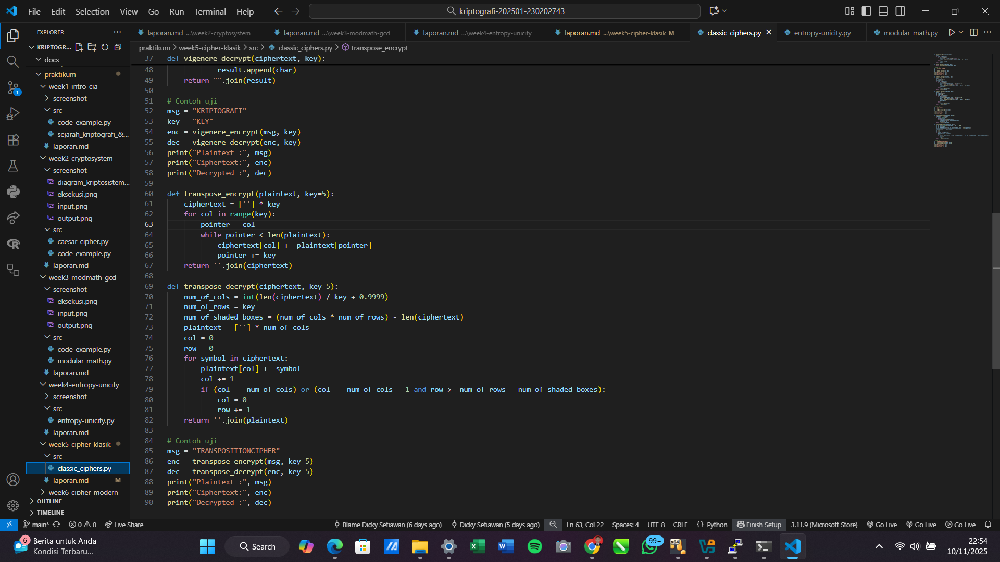
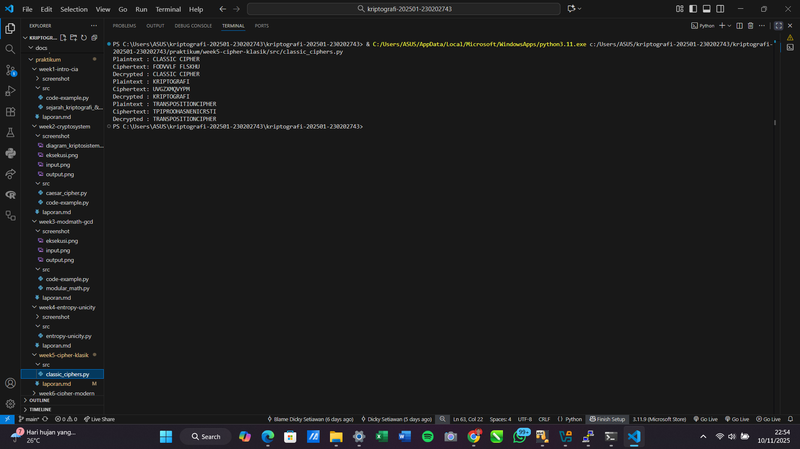

# Laporan Praktikum Kriptografi
Minggu ke-: 5  
Topik: Cipher Klasik (Caesar, Vigenère, Transposisi)  
Nama: Dicky Setiawan  
NIM: 230202743  
Kelas: 5 IKRB  

---

## 1. Tujuan
1. Menerapkan algoritma Caesar Cipher untuk enkripsi dan dekripsi teks.
2. Menerapkan algoritma Vigenère Cipher dengan variasi kunci.
3. Mengimplementasikan algoritma transposisi sederhana.
4. Menjelaskan kelemahan algoritma kriptografi klasik.

---

## 2. Dasar Teori
Cipher Klasik adalah metode enkripsi yang dominan sebelum era komputer, yang mengandalkan manipulasi karakter (huruf) menggunakan pena dan kertas. Metode ini terbagi menjadi dua kategori utama: Substitusi dan Transposisi. Kekuatan cipher ini secara keseluruhan sangat rendah karena mereka rentan terhadap analisis frekuensi dan memiliki ruang kunci (keyspace) yang terbatas, membuatnya mudah dipecahkan dengan komputasi modern.

Kategori Substitusi bekerja dengan mengganti setiap huruf plaintext dengan huruf lain. Contoh paling sederhana adalah Caesar Cipher, sebuah substitusi monoalfabetik yang mengganti setiap huruf dengan pergeseran tetap (kunci $K$), menghasilkan keamanan yang sangat rendah karena hanya memiliki 25 kunci efektif. Peningkatan signifikan adalah Vigenère Cipher, yang menggunakan substitusi polialfabetik (kata kunci yang berulang) untuk menyamarkan frekuensi huruf tunggal. Meskipun Vigenère pernah dianggap tidak dapat dipecahkan, ia tetap rentan terhadap kriptanalisis seperti Uji Kasiski yang dapat menemukan panjang kata kuncinya.

Sementara itu, Cipher Transposisi bekerja dengan mengubah urutan atau posisi huruf plaintext tanpa mengubah identitas huruf itu sendiri. Kunci pada metode ini sering kali berbentuk pola kolom. Kerentanan utamanya adalah bahwa frekuensi huruf tetap dipertahankan dalam ciphertext yang dihasilkan, berbeda dari cipher substitusi. Kriptanalis dapat dengan mudah mencari pola plaintext yang masuk akal dengan menyusun ulang kolom hingga ciphertext menghasilkan teks yang koheren.

---

## 3. Alat dan Bahan
(- Python 3.x  
- Visual Studio Code / editor lain  
- Git dan akun GitHub  
- Library tambahan (misalnya pycryptodome, jika diperlukan)  )

---

## 4. Langkah Percobaan
(Tuliskan langkah yang dilakukan sesuai instruksi.  
Contoh format:
1. Membuat file `caesar_cipher.py` di folder `praktikum/week2-cryptosystem/src/`.
2. Menyalin kode program dari panduan praktikum.
3. Menjalankan program dengan perintah `python caesar_cipher.py`.)

---

## 5. Source Code
def caesar_encrypt(plaintext, key):
    result = ""
    for char in plaintext:
        if char.isalpha():
            shift = 65 if char.isupper() else 97
            result += chr((ord(char) - shift + key) % 26 + shift)
        else:
            result += char
    return result

def caesar_decrypt(ciphertext, key):
    return caesar_encrypt(ciphertext, -key)

# Contoh uji
msg = "CLASSIC CIPHER"
key = 3
enc = caesar_encrypt(msg, key)
dec = caesar_decrypt(enc, key)
print("Plaintext :", msg)
print("Ciphertext:", enc)
print("Decrypted :", dec)

def vigenere_encrypt(plaintext, key):
    result = []
    key = key.lower()
    key_index = 0
    for char in plaintext:
        if char.isalpha():
            shift = ord(key[key_index % len(key)]) - 97
            base = 65 if char.isupper() else 97
            result.append(chr((ord(char) - base + shift) % 26 + base))
            key_index += 1
        else:
            result.append(char)
    return "".join(result)

def vigenere_decrypt(ciphertext, key):
    result = []
    key = key.lower()
    key_index = 0
    for char in ciphertext:
        if char.isalpha():
            shift = ord(key[key_index % len(key)]) - 97
            base = 65 if char.isupper() else 97
            result.append(chr((ord(char) - base - shift) % 26 + base))
            key_index += 1
        else:
            result.append(char)
    return "".join(result)

# Contoh uji
msg = "KRIPTOGRAFI"
key = "KEY"
enc = vigenere_encrypt(msg, key)
dec = vigenere_decrypt(enc, key)
print("Plaintext :", msg)
print("Ciphertext:", enc)
print("Decrypted :", dec)

def transpose_encrypt(plaintext, key=5):
    ciphertext = [''] * key
    for col in range(key):
        pointer = col
        while pointer < len(plaintext):
            ciphertext[col] += plaintext[pointer]
            pointer += key
    return ''.join(ciphertext)

def transpose_decrypt(ciphertext, key=5):
    num_of_cols = int(len(ciphertext) / key + 0.9999)
    num_of_rows = key
    num_of_shaded_boxes = (num_of_cols * num_of_rows) - len(ciphertext)
    plaintext = [''] * num_of_cols
    col = 0
    row = 0
    for symbol in ciphertext:
        plaintext[col] += symbol
        col += 1
        if (col == num_of_cols) or (col == num_of_cols - 1 and row >= num_of_rows - num_of_shaded_boxes):
            col = 0
            row += 1
    return ''.join(plaintext)

# Contoh uji
msg = "TRANSPOSITIONCIPHER"
enc = transpose_encrypt(msg, key=5)
dec = transpose_decrypt(enc, key=5)
print("Plaintext :", msg)
print("Ciphertext:", enc)
print("Decrypted :", dec)

---

## 6. Hasil dan Pembahasan
(- Lampirkan screenshot hasil eksekusi program (taruh di folder `screenshot/`).  
- Berikan tabel atau ringkasan hasil uji jika diperlukan.  
- Jelaskan apakah hasil sesuai ekspektasi.  
- Bahas error (jika ada) dan solusinya. 

Hasil eksekusi program Caesar Cipher:


Tahap eksekusi melibatkan perhitungan tiga metrik keamanan kunci utama menggunakan rumus kriptografi:Entropi Kunci ($H(K) = \log_2 |K|$): Bertujuan mengukur ukuran keamanan informasi kunci dalam bit. Hasilnya menunjukkan perbedaan drastis: Caesar hanya memiliki $\approx **4.7$ bit** ($ \log_2 26$), sedangkan AES-128 memiliki $128$ bit.Unicity Distance ($U = \frac{H(K)}{R \cdot \log_2 |A|}$): Dihitung untuk Caesar Cipher untuk menentukan panjang ciphertext minimum yang diperlukan agar kunci yang benar dapat diidentifikasi secara unik menggunakan analisis statistik.Estimasi Waktu Brute Force ($\text{Waktu (hari)} = \frac{|K|}{\text{Percobaan/detik} \cdot (3600 \cdot 24)}$): Mengestimasi waktu komputasi untuk menyerang ruang kunci secara menyeluruh.


Data masukan praktikum ini bertujuan untuk membandingkan keamanan berdasarkan dua arsitektur kunci yang kontras: Cipher Klasik (diwakili oleh Caesar Cipher) dan Cipher Modern (diwakili oleh AES-128). Ruang Kunci ($|K|$) didefinisikan secara ekstrem: $26$ untuk Caesar dan $2^{128}$ untuk AES-128. Parameter statistik bahasa yang digunakan untuk mengukur keamanan informasional meliputi Redundansi Bahasa ($R=0.75$) dan Ukuran Alfabet ($|A|=26$). Terakhir, kecepatan komputasi untuk estimasi brute force ditetapkan pada $10^6$ upaya per detik, sebuah nilai yang realistis untuk komputasi cepat.


Hasil Output menegaskan perbedaan keamanan yang masif antara kedua cipher:Unicity Distance: Untuk Caesar Cipher, hasilnya adalah $\approx **1.333$ karakter**. Secara praktis, ini berarti penyerang hanya membutuhkan sekitar $\approx 2$ karakter ciphertext untuk memecahkan kunci dengan tingkat kepercayaan yang sangat tinggi melalui analisis frekuensi, mengindikasikan keamanan informasional yang sangat rendah.Waktu Brute Force:Caesar Cipher: Hanya membutuhkan $3.009 \text{e}^{-5}$ hari, yang berarti dapat dipecahkan secara instan (dalam hitungan milidetik) oleh komputer modern.AES-128: Membutuhkan $3.938 \text{e}^{+27}$ hari. Waktu ini jauh melebihi usia alam semesta, menandakan bahwa serangan brute force pada AES-128 adalah tidak praktis dan memberikan keamanan komputasi yang tinggi.
)

---

## 7. Jawaban Pertanyaan
(Jawab pertanyaan diskusi yang diberikan pada modul.  
1. Kelemahan Utama Caesar Cipher dan Vigenère Cipher
   Kelemahan utama Caesar Cipher terletak pada kesederhanaannya yang ekstrem, yaitu hanya menggunakan substitusi monoalfabetik dengan pergeseran kunci tunggal. Karena hanya ada 25 kemungkinan kunci (jika menghitung kunci pergeseran 0 hingga 25), cipher ini sangat rentan terhadap serangan brute-force atau pencarian kunci lengkap. Penyerang dapat dengan mudah mencoba setiap kunci yang mungkin dalam hitungan detik. Selain itu, pola frekuensi huruf di plaintext dipertahankan sepenuhnya, hanya bergeser posisinya, yang berarti cipher ini juga dapat dipecahkan secara trivial menggunakan analisis frekuensi tanpa perlu mencoba semua kunci.

   Sedangkan Vigenère Cipher, meskipun jauh lebih kuat karena menggunakan substitusi polialfabetik berdasarkan kata kunci yang berulang, kelemahan utamanya adalah perulangan kunci itu sendiri. Jika panjang kunci lebih pendek daripada plaintext, kunci akan mulai berulang secara berkala. Perulangan ini menciptakan pola statistik yang dapat dieksploitasi oleh kriptanalis menggunakan metode seperti Analisis Kasiski atau Metode Indeks Koinsidensi. Teknik-teknik ini bertujuan untuk menentukan panjang kunci yang berulang. Setelah panjang kunci ditemukan, ciphertext dapat dipecah menjadi beberapa cipher Caesar yang terpisah, yang kemudian masing-masing dapat dipecahkan dengan mudah menggunakan analisis frekuensi standar.

2. Mengapa Cipher Klasik Mudah Diserang dengan Analisis Frekuensi
   Cipher klasik, baik substitusi monoalfabetik maupun transposisi, mudah diserang dengan analisis frekuensi karena mereka gagal menyembunyikan hubungan statistik antara plaintext dan ciphertext. Analisis frekuensi didasarkan pada fakta bahwa dalam bahasa alami, huruf-huruf tertentu (seperti 'E', 'T', 'A' dalam Bahasa Inggris atau 'A', 'I', 'N' dalam Bahasa Indonesia) muncul jauh lebih sering daripada yang lain. Pola frekuensi ini adalah "sidik jari" unik dari bahasa tersebut.

   Dalam cipher substitusi monoalfabetik (seperti Caesar), setiap huruf plaintext selalu disandikan menjadi huruf ciphertext yang sama. Akibatnya, huruf ciphertext yang paling sering muncul secara otomatis akan sesuai dengan huruf plaintext yang paling sering muncul. Kriptanalis hanya perlu mencocokkan frekuensi huruf ciphertext dengan frekuensi standar bahasa tersebut untuk mulai memecahkan kodenya. Sementara itu, cipher transposisi hanya mengubah urutan huruf, tetapi tidak mengubah hurufnya. Ini berarti frekuensi setiap huruf tetap sama di dalam ciphertext seperti halnya di plaintext, membuatnya sangat mudah untuk memverifikasi bahasa yang digunakan dan memberikan petunjuk penting untuk rekonstruksi plaintext.

3. Perbandingan Kelebihan dan Kelemahan Cipher Substitusi vs Transposisi
   Cipher Substitusi beroperasi dengan cara mengganti karakter plaintext dengan karakter ciphertext yang berbeda. Kelebihan utamanya, terutama pada varian polialfabetik seperti Vigenère, adalah kemampuannya untuk menyembunyikan pola frekuensi huruf tunggal, karena satu huruf plaintext dapat diwakili oleh beberapa huruf ciphertext. Namun, kelemahan mendasar dari cipher substitusi monoalfabetik adalah kerentanannya yang tinggi terhadap analisis frekuensi. Selain itu, cipher substitusi sangat efektif dalam mencapai prinsip kekacauan (confusion), yang bertujuan untuk menyembunyikan hubungan antara kunci dan ciphertext.

   Di sisi lain, Cipher Transposisi bekerja dengan cara mengubah urutan atau posisi karakter dalam plaintext tanpa mengubah karakternya sendiri. Kelebihan cipher ini adalah bahwa ia secara efektif menciptakan ciphertext yang tidak beraturan dan sulit dibaca. Cipher transposisi sangat baik dalam mencapai prinsip difusi (diffusion), di mana pengaruh satu karakter plaintext disebarkan ke banyak posisi di ciphertext. Namun, kelemahan utamanya adalah bahwa cipher ini tidak mengubah frekuensi karakter plaintext sama sekali. Dengan demikian, ciphertext transposisi masih membawa "sidik jari" statistik yang sama dengan bahasa aslinya, menjadikannya rentan terhadap teknik yang mencari pola pergeseran posisi.
---

## 8. Kesimpulan
Hasil praktikum secara kuantitatif menunjukkan bahwa Caesar Cipher memiliki entropi kunci yang sangat kecil dan Unicity Distance $\approx 1.333$ karakter, menjadikannya rentan terhadap pemecahan kunci secara instan. Sebaliknya, AES-128 dengan kunci $2^{128}$ memiliki keamanan komputasi yang tak tertandingi, di mana waktu brute force diestimasikan melebihi usia alam semesta. Oleh karena itu, cipher klasik tidak lagi aman dan kriptografi modern wajib digunakan untuk perlindungan data yang efektif.

---

## 9. Daftar Pustaka
(Cantumkan referensi yang digunakan.  
Contoh:  
- Katz, J., & Lindell, Y. *Introduction to Modern Cryptography*.  
- Stallings, W. *Cryptography and Network Security*.  )

---

## 10. Commit Log
(Tuliskan bukti commit Git yang relevan.  
Contoh:
```
commit abc12345
Author: Dicky Setiawan <email>
Date:   2025-11-10

    week5-chiper-klasik: Cipher Klasik (Caesar, Vigenère, Transposisi 
))
```
