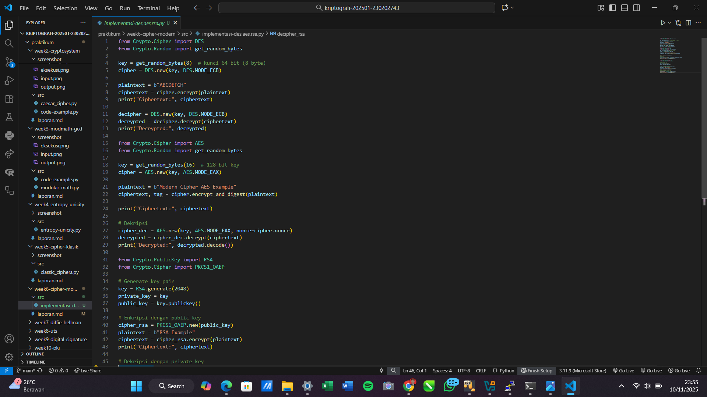

# Laporan Praktikum Kriptografi
Minggu ke-: 6  
Topik: Cipher Modern (DES, AES, RSA)  
Nama: Dicky Setiawan  
NIM: 230202743  
Kelas: 5 IKRB  

---

## 1. Tujuan
Setelah mengikuti praktikum ini, mahasiswa diharapkan mampu:

1. Mengimplementasikan algoritma DES untuk blok data sederhana.
2. Menerapkan algoritma AES dengan panjang kunci 128 bit.
3. Menjelaskan proses pembangkitan kunci publik dan privat pada algoritma RSA.

---

## 2. Dasar Teori
1. Data Encryption Standard (DES)Dasar teori DES terletak pada konsep Jaringan Feistel (atau struktur Feistel). Jaringan ini memungkinkan proses enkripsi dan dekripsi menggunakan 
   fungsi internal yang sama (disebut $f$-fungsi), asalkan sub-kunci diterapkan dalam urutan terbalik untuk dekripsi. DES menggunakan 16 putaran (rounds), di mana setiap putaran membagi blok data 64-bit menjadi dua bagian (kiri dan kanan), lalu menerapkan fungsi yang melibatkan substitusi (S-Box) dan permutasi, mencampurkan data dan kunci secara berulang. Teori ini sangat efektif dalam mencapai kekacauan (confusion) dan difusi (diffusion), dua prinsip Shannon untuk mengamankan cipher dari analisis statistik.
2. Advanced Encryption Standard (AES)Dasar teori AES didasarkan pada Jaringan Substitusi-Permutasi (SP-Network), yang merupakan pengembangan dari Feistel. AES bekerja melalui 
   serangkaian putaran transformasi yang mengubah blok data 128-bit. Setiap putaran melibatkan empat operasi matematika yang berbeda:SubBytes: Substitusi non-linear menggunakan tabel S-Box tunggal yang sangat efisien untuk mencapai kekacauan.ShiftRows: Pergeseran baris data secara siklis untuk mencapai difusi horizontal.MixColumns: Transformasi linear yang mencampurkan data antar kolom, mencapai difusi vertikal.AddRoundKey: Kombinasi kunci putaran dengan data melalui operasi XOR.Inti matematis AES adalah manipulasi matriks dan aritmatika dalam medan hingga (finite field) $GF(2^8)$, yang memberikan struktur matematika yang kuat dan efisien.
3. RSADasar teori RSA sepenuhnya terletak pada kesulitan matematis dari masalah faktorisasi bilangan prima (prime factorization). Algoritma ini beroperasi berdasarkan prinsip 
   berikut:Pembuatan Kunci: Kunci publik dan privat dihasilkan dari dua bilangan prima ($p$ dan $q$) yang sangat besar. Kunci publik adalah hasil kali kedua prima tersebut ($n = p \cdot q$).Asumsi Keamanan: Mengenkripsi data dengan kunci publik mudah dilakukan. Namun, untuk mendekripsi data atau menemukan kunci privat, penyerang harus memfaktorkan bilangan $n$ kembali menjadi $p$ dan $q$.Dasar Teori: Untuk bilangan yang sangat besar (biasanya 2048 bit atau lebih), tidak ada algoritma yang diketahui yang dapat melakukan faktorisasi dalam waktu yang wajar secara komputasi (kecuali dengan komputasi kuantum, yang masih dalam tahap pengembangan).RSA adalah contoh utama dari kriptografi kunci publik, di mana fungsi satu arah (perkalian) mudah dilakukan tetapi fungsi invers (faktorisasi) sangat sulit.

---

## 3. Alat dan Bahan
(- Python 3.x  
- Visual Studio Code / editor lain  
- Git dan akun GitHub  
- Library tambahan (misalnya pycryptodome, jika diperlukan)  )

---

## 4. Langkah Percobaan
(Tuliskan langkah yang dilakukan sesuai instruksi.  
Contoh format:
1. Membuat file `caesar_cipher.py` di folder `praktikum/week2-cryptosystem/src/`.
2. Menyalin kode program dari panduan praktikum.
3. Menjalankan program dengan perintah `python caesar_cipher.py`.)

---

## 5. Source Code
(Salin kode program utama yang dibuat atau dimodifikasi.  
Gunakan blok kode:

```python
# contoh potongan kode
def encrypt(text, key):
    return ...
```
)

---

## 6. Hasil dan Pembahasan
(- Lampirkan screenshot hasil eksekusi program (taruh di folder `screenshot/`).  
- Berikan tabel atau ringkasan hasil uji jika diperlukan.  
- Jelaskan apakah hasil sesuai ekspektasi.  
- Bahas error (jika ada) dan solusinya. 

Hasil eksekusi program Caesar Cipher:


DES dan AES: Algoritma simetris dieksekusi, di mana proses enkripsi dan dekripsi menggunakan kunci yang sama (DES mode ECB, AES mode EAX).
RSA: Algoritma asimetris dieksekusi, di mana enkripsi menggunakan kunci publik dan dekripsi menggunakan kunci privat yang sesuai (menggunakan skema PKCS1_OAEP).
Verifikasi: Dalam semua kasus, ciphertext yang dihasilkan oleh proses enkripsi kemudian diumpankan ke fungsi dekripsi.


DES: Plaintext b"ABCDEFGH" dan kunci 8 byte (64 bit) yang dihasilkan secara acak.
AES-128: Plaintext b"Modern Cipher AES Example" dan kunci 16 byte (128 bit) yang dihasilkan secara acak.
RSA: Plaintext b"RSA Example" dan pasangan kunci publik/privat 2048-bit yang dihasilkan secara acak.


DES: Ciphertext acak dihasilkan, dan Decrypted menghasilkan ABCDEFGH.
AES-128: Ciphertext acak dan panjang dihasilkan, dan Decrypted menghasilkan Modern Cipher AES Example.
RSA: Ciphertext acak dan sangat panjang dihasilkan (sesuai panjang kunci), dan Decrypted menghasilkan RSA Example.
)

---

## 7. Jawaban Pertanyaan
1. Perbedaan mendasar antara DES dan AES di satu sisi, dengan RSA di sisi lain, terletak pada jenis kuncinya. DES dan AES adalah algoritma simetris, yang berarti mereka menggunakan 
   kunci tunggal yang sama untuk mengenkripsi dan mendekripsi data. Sementara itu, RSA adalah algoritma asimetris, yang mengandalkan sepasang kunci yang berbeda (publik dan privat) yang saling terkait secara matematis. Dalam hal keamanan, DES, dengan kunci efektif 56-bit, kini dianggap tidak aman dan mudah ditembus oleh serangan brute-force modern. Sebaliknya, AES, yang menggunakan kunci 128, 192, atau 256-bit, menawarkan tingkat keamanan komputasi yang tinggi dan menjadi standar global karena ruang kuncinya yang sangat besar. Keamanan RSA, yang biasanya menggunakan kunci 2048-bit ke atas, didasarkan pada kesulitan matematis dalam memfaktorkan bilangan prima yang sangat besar.

2. AES lebih banyak digunakan dibanding DES di era modern terutama karena panjang kuncinya yang unggul. Peningkatan dari 56-bit DES ke minimum 128-bit AES menghasilkan lompatan 
   eksponensial dalam ruang kunci, membuat serangan brute-force terhadap AES menjadi tidak praktis dan membutuhkan waktu yang melebihi usia alam semesta, yang jauh lebih aman dibandingkan dengan DES yang dapat dipecahkan dalam hitungan jam.

3. RSA dikategorikan sebagai algoritma asimetris karena kebutuhan untuk memiliki dua kunci berbeda: satu kunci publik yang dapat dibagikan dan satu kunci privat yang dirahasiakan. 
   Proses pembangkitan kuncinya melibatkan pemilihan dua bilangan prima besar ($p$ dan $q$), yang digunakan untuk menghitung modulus $n = p \cdot q$ dan fungsi Euler Totient $\phi(n) = (p-1)(q-1)$. Kunci publik $(e, n)$ dan kunci privat $(d, n)$ kemudian dihasilkan dari $n$ dan $\phi(n)$. Keamanan RSA bergantung pada rahasia bilangan prima $p$ dan $q$, di mana memecahkan sandi tanpa mengetahui kunci privat sama saja dengan memecahkan masalah faktorisasi bilangan besar $n$.
---

## 8. Kesimpulan
Praktikum ini berhasil memverifikasi implementasi tiga algoritma kriptografi modern (DES, AES, dan RSA), yang membuktikan fungsionalitas enkripsi dan dekripsi mereka. Semua ciphertext yang dihasilkan, baik dari algoritma simetris (DES dan AES) maupun asimetris (RSA), berhasil dikembalikan ke plaintext aslinya. Keberhasilan ini menegaskan pemahaman tentang cara kerja dan perbedaan mendasar antara kedua jenis cipher modern.

---

## 9. Daftar Pustaka


---

## 10. Commit Log
(Tuliskan bukti commit Git yang relevan.  
Contoh:
```
commit abc12345
Author: Dicky Setiawan <dicky.settt@gmail.com>
Date:   2025-11-10

    week6-cipher-modern: Cipher Modern (DES, AES, RSA) )
```
