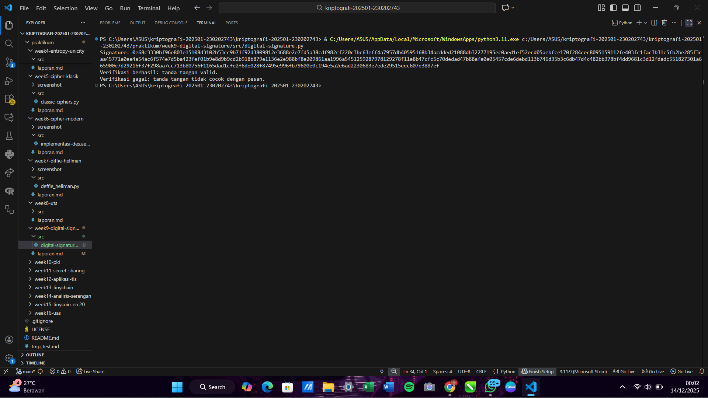

# Laporan Praktikum Kriptografi
Minggu ke-: 9  
Topik: Digital Signature (RSA/DSA)  
Nama: Dicky Setiawan  
NIM: 230202743  
Kelas: 5 IKRB  

---

## 1. Tujuan
1. Mengimplementasikan tanda tangan digital menggunakan algoritma RSA/DSA.
2. Memverifikasi keaslian tanda tangan digital.
3. Menjelaskan manfaat tanda tangan digital dalam otentikasi pesan dan integritas data.

---

## 2. Dasar Teori
Tanda tangan digital merupakan mekanisme kriptografi penting yang berfungsi untuk menjamin otentikasi pesan dan integritas data dalam komunikasi digital. Konsep dasarnya adalah penggunaan kunci asimetris, di mana pengirim menggunakan kunci privat mereka untuk mengenkripsi hash (ringkasan unik) dari pesan, dan penerima menggunakan kunci publik pengirim untuk mendekripsi hash tersebut. Algoritma seperti RSA (Rivest–Shamir–Adleman) dan DSA (Digital Signature Algorithm) adalah pilihan umum untuk mengimplementasikan proses ini. Kunci privat bertindak sebagai cap unik pengirim, sementara hash memastikan bahwa setiap perubahan sekecil apa pun pada pesan asli akan menghasilkan hash yang berbeda, sehingga mencegah pemalsuan dan modifikasi.

Proses verifikasi tanda tangan digital dilakukan melalui langkah-langkah yang ketat. Pertama, penerima menggunakan kunci publik pengirim untuk mendekripsi tanda tangan digital yang terlampir pada pesan, menghasilkan hash pesan yang diklaim oleh pengirim. Kedua, penerima secara independen menghitung hash dari pesan yang mereka terima. Ketiga, kedua nilai hash ini dibandingkan. Jika kedua hash tersebut identik, maka dua jaminan terpenuhi: Otentikasi (pesan benar-benar berasal dari pemilik kunci privat yang sah) dan Integritas (pesan tidak diubah sedikit pun selama transmisi). Jika hash tidak cocok, pesan dianggap telah dimodifikasi atau tanda tangan tersebut palsu.

Manfaat utama dari tanda tangan digital sangat krusial dalam lingkungan digital. Selain memberikan otentikasi (membuktikan identitas pengirim) dan integritas (memastikan data tidak rusak atau diubah), tanda tangan digital juga memberikan jaminan non-repudiation (nirpenyangkalan). Non-repudiation berarti pengirim tidak dapat menyangkal bahwa mereka adalah pihak yang mengirim dan menandatangani pesan tersebut, karena hanya mereka yang memiliki akses ke kunci privat yang digunakan. Hal ini sangat penting dalam transaksi keuangan, kontrak hukum digital, dan dokumen sensitif lainnya, menjadikan tanda tangan digital sebagai elemen kunci dalam membangun kepercayaan dan keamanan pada sistem komunikasi dan transaksi elektronik modern.

---

## 3. Alat dan Bahan
(- Python 3.x  
- Visual Studio Code / editor lain  
- Git dan akun GitHub  
- Library tambahan (misalnya pycryptodome, jika diperlukan)  )

---

## 4. Langkah Percobaan
1. Membuat file `digital-signature.py` di folder `praktikum/week9-cryptosystem/src/`.
2. Menyalin kode program dari panduan praktikum.
3. Menjalankan program dengan perintah `python digital-signature.py`.

---

## 5. Source Code
from Crypto.PublicKey import RSA
from Crypto.Signature import pkcs1_15
from Crypto.Hash import SHA256

# Generate pasangan kunci RSA
key = RSA.generate(2048)
private_key = key
public_key = key.publickey()

# Pesan yang akan ditandatangani
message = b"Hello, ini pesan penting."
h = SHA256.new(message)

# Buat tanda tangan dengan private key
signature = pkcs1_15.new(private_key).sign(h)
print("Signature:", signature.hex())

try:
    pkcs1_15.new(public_key).verify(h, signature)
    print("Verifikasi berhasil: tanda tangan valid.")
except (ValueError, TypeError):
    print("Verifikasi gagal: tanda tangan tidak valid.")


# Modifikasi pesan
fake_message = b"Hello, ini pesan palsu."
h_fake = SHA256.new(fake_message)

try:
    pkcs1_15.new(public_key).verify(h_fake, signature)
    print("Verifikasi berhasil (seharusnya gagal).")
except (ValueError, TypeError):
    print("Verifikasi gagal: tanda tangan tidak cocok dengan pesan.")

---

## 6. Hasil dan Pembahasan
(- Lampirkan screenshot hasil eksekusi program (taruh di folder `screenshot/`).  
- Berikan tabel atau ringkasan hasil uji jika diperlukan.  
- Jelaskan apakah hasil sesuai ekspektasi.  
- Bahas error (jika ada) dan solusinya. 

Hasil eksekusi program Caesar Cipher:




)

---

## 7. Jawaban Pertanyaan
1. Perbedaan utama antara Enkripsi RSA dan Tanda Tangan Digital RSA terletak pada tujuan dan penggunaan kunci. Enkripsi RSA bertujuan untuk menjamin kerahasiaan (confidentiality)  
   data. Ia menggunakan kunci publik penerima untuk mengunci (enkripsi) pesan, dan hanya kunci privat penerima yang dapat membukanya. Sebaliknya, Tanda Tangan Digital RSA bertujuan menjamin otentikasi dan integritas. Ia menggunakan kunci privat pengirim untuk menandatangani hash (ringkasan unik) pesan, dan kunci publik pengirim digunakan oleh penerima untuk memverifikasi.

2. Tanda tangan digital menjamin otentikasi karena hanya pemilik kunci privat yang dapat menghasilkan tanda tangan yang valid, membuktikan identitas pengirim. Ia menjamin integritas 
   karena tanda tangan dibuat berdasarkan hash pesan; jika pesan diubah, bahkan sedikit pun, hash yang dihasilkan penerima akan berbeda dengan tanda tangan yang diverifikasi, mengindikasikan bahwa pesan telah dirusak.

3. Dalam sistem modern, Certificate Authority (CA) memainkan peran krusial sebagai pihak ketiga tepercaya. CA memverifikasi identitas pengguna atau server, kemudian mengeluarkan 
   Sertifikat Digital yang secara resmi mengikat kunci publik mereka dengan identitas yang terverifikasi. Peran CA adalah untuk menghilangkan masalah kepercayaan: ketika Anda memverifikasi tanda tangan digital seseorang menggunakan kunci publik mereka, Anda percaya bahwa kunci tersebut benar-benar milik mereka karena telah "disahkan" oleh CA.
---

## 8. Kesimpulan
Praktikum ini berhasil mengimplementasikan dan mendemonstrasikan proses tanda tangan digital menggunakan algoritma RSA dan library PyCryptodome, dimulai dari pembuatan pasangan kunci hingga menghasilkan dan memverifikasi tanda tangan. Melalui pengujian, mahasiswa berhasil membuktikan bahwa tanda tangan digital secara efektif menjamin otentikasi pesan (dibuat hanya oleh pemilik kunci privat yang sah) dan integritas data, karena setiap modifikasi pada pesan akan menyebabkan verifikasi tanda tangan gagal total. Dengan demikian, tujuan pembelajaran untuk mengimplementasikan dan menjelaskan manfaat tanda tangan digital dalam keamanan pesan telah tercapai.

---

## 9. Daftar Pustaka

---

## 10. Commit Log
(Tuliskan bukti commit Git yang relevan.  
Contoh:
```
commit abc12345
Author: Dicky Setiawan <dicky.settt@gmail.com>
Date:   2025-09-20

    week9-digital-signature: Digital Signature (RSA/DSA)
```
